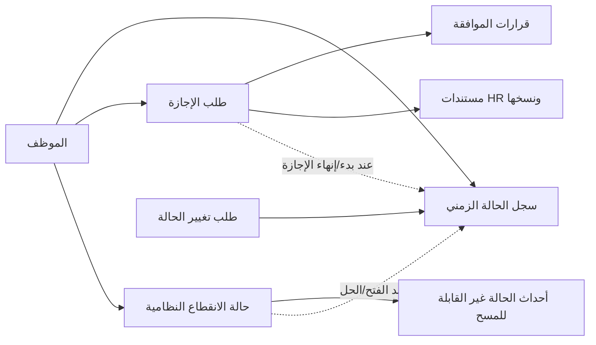

# خطة V2: الإجازات وحالات الانقطاع وتغيير حالة الموظف

## القرار المعماري

هذه المجالات جزء من Workforce في نظام البوابة وليست أنظمة أدوار مستقلة:

- الإجازة workflow موافقات يعتمد على صلاحيات النظام ونطاقاتها.
- حالة الانقطاع/الهروب compliance case ذات مسارين حصريين ومواعيد نظامية.
- حالة الموظف الحالية enum في `Employee.CurrentStatus`، وتاريخها الكامل في `EmployeeStatusPeriod`.
- أي اعتماد لإجازة أو فتح حالة انقطاع قد يطلب تغيير حالة الموظف، لكن السجل التاريخي لا يكتب مرتين ولا يمسح.
- لا توجد خدمات أو controllers في المرحلة الحالية؛ النطاق هو models وEF configurations فقط.

## نماذج الإجازات المعتمدة مبدئيًا

### `LeaveType`

كتالوج لأنواع الإجازات بدل hard-coded status: الكود، الاسمان العربي والإنجليزي، هل تحتاج رصيدًا أو مستندات HR أو تأشيرة خروج وعودة، الحد الأعلى للأيام، والحالة.

### `LeaveApprovalWorkflow` و`LeaveApprovalWorkflowStep`

يعرّفان مسار الموافقة دون إنشاء أدوار إجازات مكررة. اختيار المسار يمكن أن يعتمد على:

- نوع الإجازة.
- نوع علاقة الموظف: داخلي مكفول أو رايدر خارجي.
- هل الموظف رايدر.
- منصة العميل الحالية، مثل كيتا، إذا احتاجت خطوة خاصة.
- الأولوية وتاريخ السريان والإصدار.

كل خطوة تحتوي `RequiredPermissionKey` ومصدر نطاق الصلاحية: كل الشركة، سكن الموظف، منصة العميل الحالية، أو عقد العميل الحالي. عند تقديم الطلب تحفظ نسخة JSON من تعريف workflow على الطلب حتى لا يتغير مسار طلب قديم عند تعديل الإعدادات.

### `LeaveRequest`

الخصائص الأساسية: رقم الطلب، الموظف، نوع الإجازة، البداية والنهاية والعودة المتوقعة وعدد الأيام، السبب، وجهة السفر، اتصال الطوارئ، حالة workflow، خطوة الموافقة الحالية، حالة HR، lifecycle timestamps، الرفض والإلغاء، عقد العميل المرتبط، والملاحظات.

قيود مهمة:

- النهاية لا تسبق البداية.
- عدد الأيام يساوي المدة التقويمية المحسوبة.
- رقم الطلب فريد.
- `RowVersion` يمنع قرارين متزامنين على الطلب نفسه.
- تداخل الإجازات المعتمدة لنفس الموظف يمنع في طبقة command لاحقًا داخل transaction.

### `LeaveApprovalDecision`

append-only: الطلب، مفتاح الخطوة وترتيبها، الصلاحية المطلوبة، صاحب القرار، الوقت، القرار، الحالة قبل وبعد، الخطوة المعاد إليها، التعليق، ونسخة الصلاحيات وقت القرار.

### طلبات التعديل والإلغاء

- `LeaveDateChangeRequest`: التواريخ السابقة والمطلوبة، السبب، الطالب، الحالة، ومن حل الطلب والقرار.
- `LeaveCancellationRequest`: السبب، الطالب، الحالة، ومن حل الطلب والقرار.
- يسمح بطلب pending واحد فقط من كل نوع لكل إجازة بواسطة filtered unique index.

### مستندات HR

- `LeaveRequestDocument`: نوع المستند، المرجع، تاريخ الإصدار والانتهاء، النسخة الحالية.
- `LeaveRequestDocumentVersion`: رقم نسخة، اسم الملف، النوع والحجم، checksum، مسار التخزين، الرافع والتوقيت، والنسخة السابقة.
- لا تستبدل الملفات القديمة؛ النسخ السابقة تبقى محفوظة.

## حالة الانقطاع/الهروب

استخدم الاسم المحايد في قاعدة البيانات `EmployeeAbsenceComplianceCase`، بينما يمكن أن تعرض الواجهة الاسم القانوني الذي تعتمده البوابة.

الخصائص: رقم الحالة، الموظف، تاريخ الانقطاع، المسار الحالي، الحالة، تاريخ/مرجع البلاغ، تاريخ الخروج أو تعطل النظام ورقم التأشيرة، الموعد النهائي للإزالة، الملاحظات، بيانات الحل والإغلاق.

القواعد:

- حالة فعالة واحدة فقط لكل موظف.
- المساران متنافيان في الحقول الحالية.
- الموعد النهائي لا يسبق تاريخ بدء المسار.
- لا نخزن `RemainingDays` لأنه يتغير يوميًا؛ يحسب من `RemovalDeadline` وتاريخ اليوم بمنطقة الرياض.
- عند تبديل المسار تسجل القيمة السابقة والجديدة في `EmployeeAbsenceComplianceCaseEvent` قبل تحديث الحقول الحالية.
- التنبيه قبل عشرة أيام يستخدم `Notification.DeduplicationKey`، ولا يحتاج boolean دائم داخل الحالة.
- الحل أو الإغلاق لا يحذف الحالة، ولا يوجد force-delete.

## تغيير حالة الموظف

`EmployeeStatusChangeRequest` يستبدل temp model القديم ويحتوي رقم الطلب، الموظف، الحالة الحالية والمطلوبة، تاريخ السريان، السبب، الطالب والتوقيت، القرار وصاحبه، وربط `ResultingStatusPeriodId`.

عند الاعتماد لاحقًا داخل transaction واحدة:

1. يقفل `Employee` و`RowVersion`.
2. يتحقق أن `FromStatus` ما زالت الحالة الحالية.
3. يغلق `EmployeeStatusPeriod` الفعال.
4. ينشئ period جديدًا بالحالة المطلوبة.
5. يحدث `Employee.CurrentStatus` كنسخة قراءة سريعة.
6. يربط الطلب بالسجل الناتج ويسجل audit.

التحديث المباشر للحالة يجب أن يمر بنفس command؛ لا يسمح بتغيير `Employee.CurrentStatus` منفردًا.

## تكامل المجالات

## فهارس الأداء

- `LeaveRequest(EmployeeId, StartDate, EndDate)`.
- `LeaveRequest(Status, CurrentApprovalStepKey, SubmittedAtUtc)` لصندوق الموافقات.
- `LeaveRequest(HrStatus, StartDate)` لصندوق HR.
- قرارات الإجازة `(LeaveRequestId, StepSequence, DecidedAtUtc)`.
- حالة الانقطاع `(Status, RemovalDeadline)` للتنبيهات والمتأخر.
- filtered unique للحالة الفعالة لكل موظف.
- filtered unique لطلب تغيير حالة pending لكل موظف.

## صلاحيات مستقبلية

- `Leave.Requests.ViewOwn/Create/Amend/Cancel`.
- `Leave.Requests.ViewAll/Decide/ForceCancel`.
- `Leave.HrDocuments.View/Manage`.
- `Workforce.AbsenceCases.View/Create/ChangePath/Resolve/Close`.
- `Workforce.StatusChanges.Request/Approve/DirectChange`.
- المستندات والبيانات النظامية لا تظهر إلا لمن يملك الإذن والنطاق المناسب.

## الأسئلة المطلوبة قبل بناء الخدمات والـ API

1. ما أنواع الإجازات التي تعمل بها البوابة، وهل يوجد رصيد سنوي فعلي؟
2. هل الأيام تحسب تقويمية أم أيام عمل مع استبعاد الجمعة/السبت والعطل؟
3. هل يوم العودة هو اليوم التالي لنهاية الإجازة دائمًا؟
4. ما ترتيب الموافقين الدقيق، ومتى تضاف موافقة مدير منصة كيتا أو غيرها؟
5. هل المحاسب خطوة اعتماد أم خطوة تسجيل تكلفة تذكرة فقط؟
6. هل يمكن إعادة الطلب إلى أي خطوة سابقة أم إلى مقدم الطلب فقط؟
7. متى تصبح حالة الموظف `OnLeave`: في تاريخ البداية آليًا أم عند تسجيل المغادرة؟
8. هل HR ticket والفيزا إلزاميان لكل موظف داخلي أم وفق نوع الإجازة/الجنسية؟
9. هل مهلة المسارين 60 يومًا ثابتة قانونيًا أم إعداد قابل للتغيير؟
10. ما المصطلح العربي الرسمي المطلوب في الواجهة لحالة `EmployeeAbsenceComplianceCase`؟
11. عند فتح الحالة، ما `EmployeeStatus` المطلوب: Suspended أم حالة جديدة؟
12. ما شروط حل الحالة وإعادة الموظف للعمل، وما المستندات المطلوبة؟
