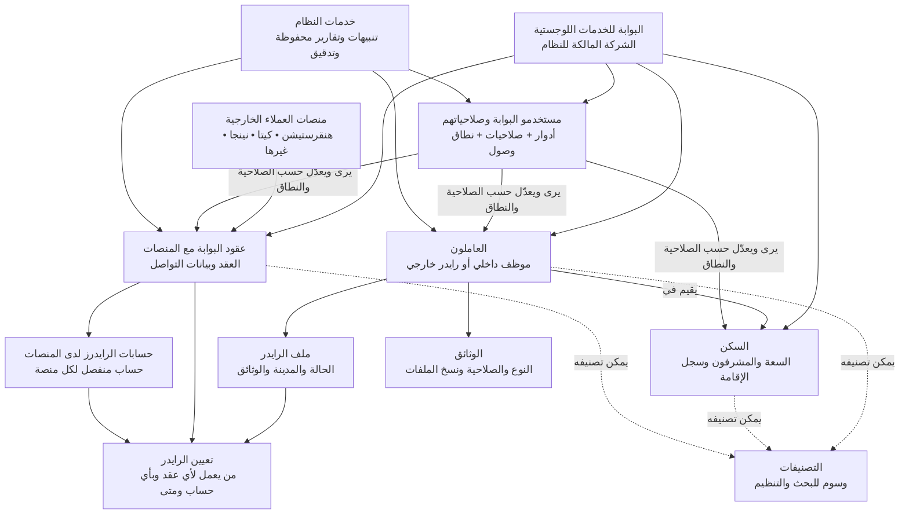

# مخطط مبسّط لنماذج نظام إدارة اللوجستيات

هذا المخطط يشرح المجالات الرئيسية وعلاقتها ببعضها بلغة عمل مبسطة. النظام مملوك لشركة **البوابة للخدمات اللوجستية**، أما هنقرستيشن وكيتا ونينجا وغيرها فهي منصات عملاء خارجية تتعامل معها البوابة.

## رحلة مبسطة للرايدر

## قواعد يفهمها غير التقني

- النظام خاص بشركة البوابة للخدمات اللوجستية فقط، وليس نظامًا متعدد الشركات.
- منصات العملاء لا تسجل الدخول كجهات مستقلة؛ تحفظ البوابة بيانات التعامل والعقود والحسابات الخاصة بها.
- الصلاحية تحدد **ماذا** يمكن لمستخدم البوابة فعله، ونطاق الوصول يحدد **على أي بيانات** يمكنه فعله.
- لا يُحذف أي سجل نهائيًا؛ يُعلَّم كمحذوف مع وقت الحذف وسببه ومن قام به.
- كل تغيير زمني مهم، مثل حالة الموظف أو السكن أو التعيين، له سجل تاريخ مستقل.
- الرايدر لديه ملف واحد، ويمكن ربطه بعقد وحساب منصة واحد نشط في اللحظة نفسها.
- كلمات مرور حسابات المنصات لا تُخزّن كنص واضح؛ تُحفظ بنسخ مشفرة قابلة للتدوير.
