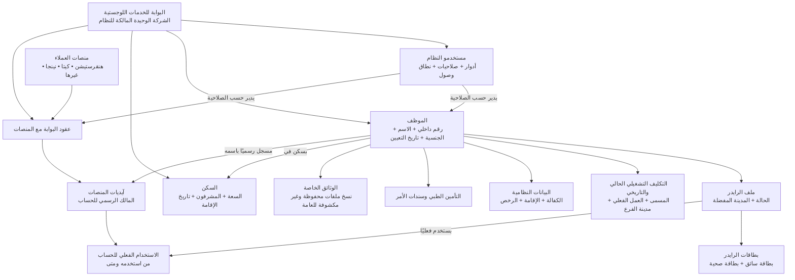
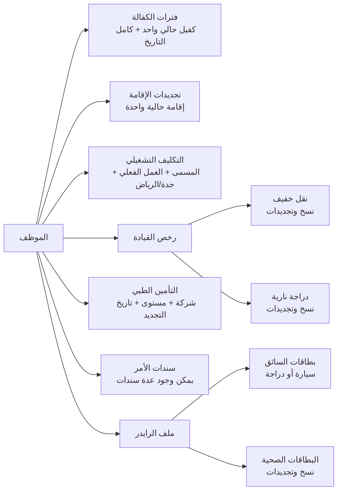
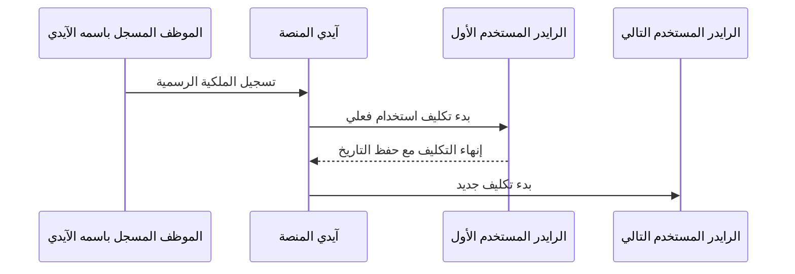

# مخطط مبسّط لنماذج نظام إدارة اللوجستيات

النظام مملوك لشركة **البوابة للخدمات اللوجستية** فقط. لا يوجد `Tenant` ولا شركات مالكة متعددة؛ هنقرستيشن وكيتا ونينجا وغيرها منصات عملاء تتعامل معها البوابة.

## الصورة العامة

## ملف الموظف والرايدر

## ملكية آيدي المنصة واستخدامه

الملكية الرسمية لا تتغير لمجرد تبديل المستخدم الفعلي. يمنع النموذج استخدام الحساب نفسه بواسطة رايدرين في الوقت نفسه، كما يمنع وجود أكثر من تكليف منصة نشط للرايدر نفسه.

## قواعد يفهمها غير التقني

- لا يوجد حذف نهائي من التطبيق؛ السجلات التشغيلية تستخدم حذفًا منطقيًا، والتاريخ القديم يبقى محفوظًا.
- يمكن إغلاق الفترة الحالية مرة واحدة، ولا يمكن إعادة فتحها أو تعديل تاريخها القديم.
- الفرع الفعلي هو مدينة التكليف التشغيلي، وليس المدينة المفضلة في ملف الرايدر.
- يمكن للموظف امتلاك رخصة نقل خفيف ورخصة دراجة نارية حاليتين معًا، لكن لا يمكن وجود رخصتين حاليتين من النوع نفسه.
- نقل الكفالة، تجديد الإقامة أو الرخصة أو البطاقة أو التأمين ينشئ سجلًا جديدًا ويحفظ السابق.
- ملفات الإقامة والرخص والبطاقات والسندات والتأمين تُربط بنسخ وثائق، ومسارها مخطط تحت `wwwroot/private` دون كشفه كملفات عامة.
- حقول الأرقام الحساسة مصممة لحفظ النص المشفر، وبصمة بحث دقيقة، وآخر أربعة أرقام للعرض. تنفيذ التشفير نفسه مطلوب قبل إدخال بيانات حقيقية.
- كلمات مرور حسابات المنصات لا تُخزّن كنص واضح؛ تحفظ في نسخ بيانات اعتماد مشفرة قابلة للتدوير.
