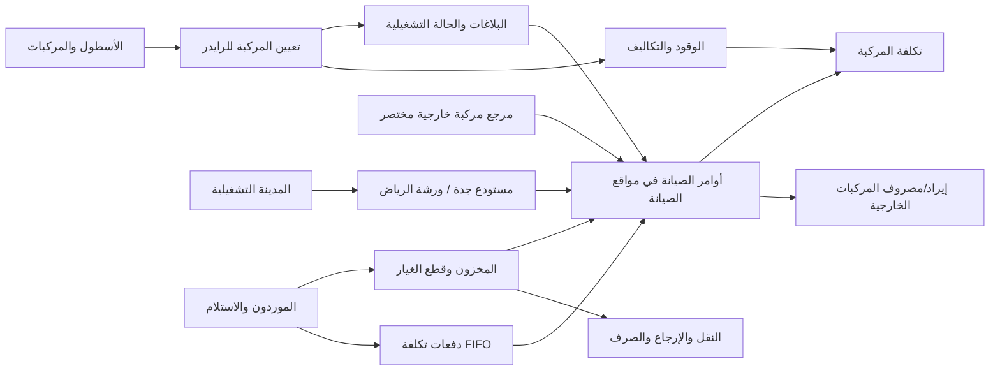

# الخطة الجانبية: المركبات والصيانة والمخزون — الإصدار الثاني

## 1. الهدف وحدود هذه الخطة

هذه الخطة هي المرجع التشغيلي للإصدار الجديد المبني على فهم سلوك النظام القديم دون نسخ بنيته. نُفذت نماذج الصيانة والمخزون والزيوت وواجهاتها وصلاحياتها في الـ backend، وأضيفت migrations قابلة للمراجعة. تبقى قرارات القسم 16 تخص التوسع أو الترحيل الإنتاجي، ولا تعيد فتح القواعد المثبتة أدناه.

الإصدار الجديد يجب أن يحقق الآتي:

- سجل ثنائي الاتجاه ودقيق: تاريخ الرايدرز لكل مركبة، وتاريخ المركبات لكل رايدر.
- عدم تخزين `VehicleNumber` داخل ملف الرايدر بوصفه مصدر الحقيقة.
- عدم استعمال رقم اللوحة أو رقم الأصل كمفتاح قاعدة بيانات؛ المفتاح الداخلي دائمًا `Guid` من نوع UUIDv7.
- عدم حذف أي مركبة، تعيين، حركة مخزون، استخدام قطعة، مصروف، أو طلب. الإلغاء والتصحيح يتمان بحالات وأحداث عكسية.
- فصل حالة المركبة التشغيلية عن التعيين، وعن البلاغ، وعن أمر الصيانة.
- فصل موقع الصيانة عن السكن وربطه بالمدينة التشغيلية مباشرة.
- تشغيل الصيانة من موقعين مبدئيين: `مستودع جدة` لمركبات الشركة فقط، و`ورشة الرياض` لمركبات الشركة والمركبات الخارجية.
- عدم إنشاء ملف مركبة كامل للمركبة الخارجية؛ يحفظ أمر الصيانة مرجعًا مختصرًا لها مع الإيراد والمصروف.
- دفتر مخزون append-only يكون مصدر الحقيقة، مع رصيد سريع للقراءة محمي بـ `RowVersion`.
- تقييم صرف قطع الغيار والزيوت بطريقة FIFO حسب دفعات التكلفة؛ لا تستخدم الدفعة الجديدة الأغلى قبل نفاد الدفعات الأقدم.
- حفظ استهلاك الصيانة في سجل المركبة وسجل الرايدر الذي كانت المركبة بعهدته وقت الاستخدام.
- إدارة الزيت باللتر حتى لو كان الشراء بالبرميل، مع حفظ حجم/وزن العبوة وسعرها وحساب تكلفة اللتر.
- تذكير تغيير الزيت للسيارة ضمن نافذة 4,000–5,000 كم، وللدراجة النارية ضمن نافذة 800–1,000 كم.
- تنفيذ جميع العمليات المركبة داخل transaction واحدة مع حماية من التزامن.
- دعم `GET all` ببيانات قائمة مختصرة للواجهة والبحث الحي محليًا، مع endpoints مستقلة للتفاصيل والسجل الثقيل.

### 1.1 قرارات العمل المثبتة

| المجال | القرار |
|---|---|
| مواقع الصيانة | لا ينشأ أمر صيانة على سكن. كل أمر صيانة مرتبط بـ `MaintenanceLocation` مرتبط بمدينة تشغيلية. |
| مستودع جدة | يقبل مركبات الشركة فقط، ويحتوي مخزونًا يمكن الصرف منه. |
| ورشة الرياض | تقبل مركبات الشركة والمركبات الخارجية، وتبيع قطع الغيار، وتسجل أجرة الإصلاح المدفوعة للميكانيكي، وتحسب مكسب كل أمر والفترة. |
| المركبات الخارجية | لا تدخل سجل الأسطول ولا تحتاج كل بيانات المركبة؛ يحفظ مرجع مختصر داخل أمر العمل وتظهر ماليًا كإيراد ومصروف وصافي. |
| تسعير المخزون | FIFO إلزامي لكل قطعة/زيت داخل الموقع؛ سعر الصرف ليس آخر سعر شراء ولا متوسط السعر. |
| نسبة الاستخدام | كل استخدام لمركبة شركة يحفظ `VehicleId` و`RiderProfileId`/`RiderVehicleAssignmentId` عند وجود تعيين فعال. |
| الزيت | الشراء قد يكون براميل بحجم تقريبي 208 لتر، لكن الحجم الفعلي المدخل في الفاتورة هو المعتمد والتكلفة التشغيلية تحسب باللتر. |
| زيت السيارة | بدون تغيير الفلتر: 3.5 لتر. مع تغيير الفلتر: 4.0 لتر + تكلفة فلتر واحد. |
| تذكير الزيت | السيارة: يبدأ الاستحقاق عند 4,000 كم ويتجاوز الحد عند 5,000 كم. الدراجة: يبدأ عند 800 كم ويتجاوز الحد عند 1,000 كم. |

## 2. حدود المجالات



## 3. القواعد المشتركة لكل نموذج قابل للتعديل

كل كيان رئيسي قابل للتعديل يرث من `AuditableEntity` ويحتوي تلقائيًا:

- `Id`: UUIDv7.
- `CreatedAtUtc`, `CreatedByUserId`.
- `UpdatedAtUtc`, `UpdatedByUserId`.
- `RowVersion`: optimistic concurrency في SQL Server.
- `IsDeleted`, `DeletedAtUtc`, `DeletedByUserId`, `DeletionReason`.

كيانات التاريخ ودفتر المخزون لا تقبل الحذف المنطقي المعتاد؛ هي append-only وتحتوي `CreatedAtUtc` و`CreatedByUserId`. التصحيح يسجل حدثًا جديدًا يشير إلى السجل المصحح.

## 4. نماذج الأسطول وخصائصها

### 4.1 `Vehicle`

السجل الرئيسي الثابت نسبيًا للمركبة.

- الهوية: `Id`, `AssetNumber`, `NormalizedAssetNumber`.
- اللوحة: `PlateNumberAr`, `NormalizedPlateNumberAr`, `PlateNumberEn`, `NormalizedPlateNumberEn`, `PlateLetterAr1..3`, `PlateLetterEn1..3`, `PlateDigits`.
- تعريف المصنع: `Vin`, `ChassisNumber`, `EngineNumber`, `ManufacturerId`, `VehicleModelId`, `ModelYear`, `ColorAr`, `ColorEn`.
- التصنيف: `VehicleType`, `FuelType`, `TransmissionType`.
- الملكية: `OwnershipType`, `OwnerName`, `AcquisitionDate`, `AcquisitionCost`, `LeaseContractReference`.
- التسجيل والتأمين: `RegistrationNumber`, `RegistrationExpiryDate`, `InsurancePolicyNumber`, `InsuranceExpiryDate`, `PeriodicInspectionExpiryDate`.
- التشغيل الحالي كنسخة قراءة: `CurrentOperationalStatus`, `OperatingCityId`, `CurrentOdometer`, `LastOdometerAtUtc`.
- النهاية: `DecommissionedAtUtc`, `DecommissionReason`.
- العرض: `PrimaryImageDocumentId`, `Notes`.

قواعد قاعدة البيانات:

- `AssetNumber` فريد ولا يعاد استعماله حتى بعد الأرشفة.
- `Vin` فريد عندما تكون له قيمة.
- اللوحة العربية المطبّعة فريدة عندما تكون لها قيمة.
- `CurrentOdometer >= 0`, و`ModelYear` ضمن نطاق منطقي.
- حقول `Current...` projections فقط؛ السجل الزمني هو مصدر الحقيقة.

### 4.2 `VehicleManufacturer`

- `Code`, `NameAr`, `NameEn`, `Status`, `DisplayOrder`.
- `Code` فريد.

### 4.3 `VehicleModel`

- `VehicleManufacturerId`, `Code`, `NameAr`, `NameEn`, `VehicleType`, `DefaultFuelType`, `Status`.
- `(VehicleManufacturerId, Code)` فريد.

### 4.4 `MaintenanceLocation`

يمثل موقعًا فعليًا مستقلًا للصيانة و/أو مخزون الصيانة. لا يرث من السكن ولا يحتوي `HousingId`.

- التعريف: `Code`, `NameAr`, `NameEn`, `OperatingCityId`.
- النوع: `LocationType` (`Warehouse`, `Workshop`, `WarehouseAndWorkshop`).
- نطاق الخدمة: `AllowsCompanyVehicles`, `AllowsExternalVehicles`, `AllowsSparePartSales`, `AllowsPaidExternalRepairs`.
- المخزون: `InventoryEnabled`.
- العنوان والتشغيل: `Address`, `Latitude`, `Longitude`, `Status`, `Notes`.

القيود:

- `OperatingCityId` إلزامي ويرتبط بـ `OperatingCity` الموجود في كتالوج النظام.
- السكن لا يظهر ضمن قائمة مواقع أمر الصيانة، ولا يوجد مسار يحول `HousingId` إلى موقع صيانة ضمنيًا.
- لا يقبل أمر مركبة شركة إذا كان `AllowsCompanyVehicles = false`، ولا يقبل أمر مركبة خارجية إذا كان `AllowsExternalVehicles = false`.
- لا يصرف مخزون من الموقع إذا كان `InventoryEnabled = false`.
- `Code` فريد ولا يعاد استخدامه بعد الأرشفة.

بيانات seed الأولى:

| Code | الاسم | المدينة | النوع | مركبات الشركة | المركبات الخارجية | بيع القطع | إصلاح خارجي مدفوع | المخزون |
|---|---|---|---|---:|---:|---:|---:|---:|
| `JEDDAH_WAREHOUSE` | مستودع جدة | جدة | `WarehouseAndWorkshop` | نعم | لا | لا | لا | نعم |
| `RIYADH_WORKSHOP` | ورشة الرياض | الرياض | `Workshop` | نعم | نعم | نعم | نعم | نعم |

### 4.5 `VehicleOdometerReading`

- `VehicleId`, `Reading`, `RecordedAtUtc`, `SourceType`, `SourceEntityId`, `EvidenceDocumentId`, `Notes`.
- لا يسمح بقراءة سالبة أو قراءة أقل من السابقة إلا بعملية تصحيح مع سبب وموافقة.
- فهرس `(VehicleId, RecordedAtUtc DESC)`.

### 4.6 `VehicleOperationalStatusPeriod`

- `VehicleId`, `Status`, `EffectiveFromUtc`, `EffectiveToUtc`.
- `ReasonCode`, `Reason`, `SourceType`, `SourceEntityId`, `ChangedByUserId`.
- الحالات المقترحة: `Available`, `Assigned`, `ProblemHold`, `MaintenanceHold`, `Stolen`, `OutOfService`, `Decommissioned`.
- فهرس filtered unique على `VehicleId` عندما `EffectiveToUtc IS NULL` لضمان حالة حالية واحدة.
- `Returned`, `Fixed`, و`Switched` أحداث وليست حالات طويلة العمر.

## 5. التعيين والتاريخ الثنائي بين المركبة والرايدر

### 5.1 `RiderVehicleAssignment`

هذا هو مصدر الحقيقة لعلاقة الرايدر بالمركبة.

- الأطراف: `RiderProfileId`, `EmployeeId`, `VehicleId`.
- الربط التشغيلي: `OperationId` لربط الاستلام/الإرجاع/التبديل في عملية واحدة، و`PreviousAssignmentId` عند التبديل.
- البداية: `StartedAtUtc`, `StartOperatingCityId`, `StartLocationSnapshot`, `StartOdometer`, `StartVehicleCondition`, `StartFuelLevelPercentage`.
- النهاية: `EndedAtUtc`, `EndOperatingCityId`, `EndLocationSnapshot`, `EndOdometer`, `EndVehicleCondition`, `EndFuelLevelPercentage`.
- التصريح: `PermissionReference`, `PermissionStartsOn`, `PermissionEndsOn`.
- القرار: `Status` (`Planned`, `Active`, `Completed`, `Cancelled`, `Corrected`).
- الأسباب: `AssignmentReason`, `CompletionReason`, `CancellationReason`.
- المسؤولون: `HandedOverByUserId`, `ReceivedBackByUserId`, `AssignedByUserId`, `EndedByUserId`.
- الإثبات: `StartChecklistJson`, `EndChecklistJson`, `StartEvidenceDocumentGroupId`, `EndEvidenceDocumentGroupId`.
- الاستثناءات: `WasBackdated`, `BackdatedReason`, `CorrectionOfAssignmentId`, `CorrectionReason`.
- ملاحظات: `Notes`.

القيود الحاسمة:

- filtered unique على `RiderProfileId` عندما `EndedAtUtc IS NULL AND IsDeleted = 0`.
- filtered unique على `VehicleId` عندما `EndedAtUtc IS NULL AND IsDeleted = 0`.
- `EndedAtUtc > StartedAtUtc` عند وجود النهاية.
- `EndOdometer >= StartOdometer` ما لم يوجد تصحيح معتمد.
- `EmployeeId` يجب أن يطابق الموظف المرتبط بـ `RiderProfileId`.
- تفعيل التعيين يفتح حالة `Assigned` للمركبة في transaction نفسها.
- إنهاء التعيين يغلق الحالة الحالية وينشئ `Available` أو حالة حجب مناسبة.

### 5.2 `RiderVehicleAssignmentEvent`

سجل append-only لكل ما حدث داخل التعيين:

- `RiderVehicleAssignmentId`, `OperationId`, `EventType`.
- `OccurredAtUtc`, `ActorUserId`, `Reason`.
- `BeforeJson`, `AfterJson`, `CorrelationId`.
- الأنواع: `Requested`, `Approved`, `Started`, `PermissionRenewed`, `Returned`, `SwitchedOut`, `SwitchedIn`, `Corrected`, `Cancelled`.

### 5.3 `VehicleOperationRequest`

- `RequestNumber`, `RequestType` (`Take`, `Return`, `Switch`, `ReportProblem`, `Recover`, `Relocate`).
- `RequestedByUserId`, `RequestedForRiderProfileId`.
- `CurrentVehicleId`, `RequestedVehicleId`, `RequestedOperatingCityId`.
- `Reason`, `RequestedAtUtc`, `RequestedEffectiveAtUtc`.
- `Status` (`Pending`, `Approved`, `Rejected`, `Cancelled`, `Executed`, `Failed`).
- `ReviewedByUserId`, `ReviewedAtUtc`, `ReviewReason`.
- `ExecutedAtUtc`, `ResultingAssignmentId`, `FailureCode`, `FailureDetails`.
- `RowVersion` يمنع اعتماد الطلب مرتين.

### 5.4 الاستعلامان الإلزاميان للتاريخ

`GET /api/v1/vehicles/{vehicleId}/rider-timeline`

- يعيد جميع التعيينات مرتبة تنازليًا.
- كل عنصر يعيد بيانات الرايدر المختصرة، البداية والنهاية والمدة، مواقع التسليم والاسترجاع، العداد، التصريح، الأسباب، المسؤولين، الحالة، والمشكلات والصيانة والوقود الواقعة داخل الفترة.

`GET /api/v1/riders/{riderProfileId}/vehicle-timeline`

- يعيد نفس DTO ونفس الحقائق، لكن مجمعة من جهة الرايدر.
- يجب أن يعطي الطرفان نفس `AssignmentId` ونفس القيم؛ يوجد integration test يثبت التناظر.

## 6. البلاغات والصيانة

### 6.1 `VehicleIssue`

- `IssueNumber`, `VehicleId`, `ReportedByUserId`, `ReportedAtUtc`.
- `Category`, `Severity`, `Description`, `ReportedOperatingCityId`, `ReportedLocationText`, `OdometerAtReport`.
- `Status` (`Open`, `Triaged`, `WorkOrderCreated`, `Resolved`, `Closed`, `Rejected`).
- `SafetyCritical`, `VehicleBlocked`, `ResolvedAtUtc`, `ResolvedByUserId`, `ResolutionSummary`.
- `RelatedAssignmentId` يحفظ الرايدر المستخدم وقت البلاغ صراحة.

### 6.2 `VehicleIssueEvent`

- `VehicleIssueId`, `EventType`, `FromStatus`, `ToStatus`, `OccurredAtUtc`, `ActorUserId`, `Reason`, `SnapshotJson`.
- append-only.

### 6.3 `MaintenanceWorkOrder`

- `WorkOrderNumber`, `ServiceSubjectType` (`CompanyVehicle`, `ExternalVehicle`).
- `VehicleId` اختياري ظاهريًا وإلزامي عندما يكون النوع `CompanyVehicle`، ويجب أن يكون فارغًا للمركبة الخارجية.
- `VehicleIssueId` اختياري ولا يسمح به للمركبة الخارجية.
- `MaintenanceLocationId` إلزامي ويشير إلى `MaintenanceLocation` فقط، وليس إلى سكن.
- `MaintenanceType` (`Preventive`, `Corrective`, `Inspection`, `AccidentRepair`, `OilChange`, `PartSaleOnly`).
- `Priority`, `Status`, `ExternalSupplierId` اختياري.
- `OpenedAtUtc`, `ScheduledAtUtc`, `StartedAtUtc`, `CompletedAtUtc`, `ClosedAtUtc`.
- `OdometerAtOpen`, `OdometerAtCompletion`.
- `Diagnosis`, `WorkPerformed`, `QualityCheckNotes`.
- `OpenedByUserId`, `AssignedTechnicianUserId`, `ApprovedByUserId`, `ClosedByUserId`.
- `RiderVehicleAssignmentId`, `AttributedRiderProfileId` snapshot اختياريان لمركبة الشركة، ويتم حلهما من التعيين الفعال وقت بدء/تنفيذ العمل.
- `EstimatedCost`, `ActualMaterialCost`, `ActualLaborCost`, `ActualOtherCost`, `ActualTotalCost` هي projections محسوبة من السطور المرحّلة، وليست أسعارًا قابلة للكتابة يدويًا.
- `RowVersion`.

قواعد الموضوع والموقع:

- يتحقق النظام من exactly-one rule: إما `VehicleId` لمركبة الشركة أو `ExternalVehicleSnapshot`، وليس كليهما.
- `مستودع جدة` يرفض `ExternalVehicle` حتى لو حاول العميل تجاوز الواجهة.
- `ورشة الرياض` تقبل النوعين.
- المركبة الخارجية لا تنشأ في جدول `Vehicle` ولا تدخل تقارير أصول الشركة أو تعيينات الرايدرز أو تذكيرات الأسطول.
- لا يغلق أمر العمل بعد البدء إلا بعد ترحيل أو عكس جميع حركات المواد والزيت المرتبطة به.

### 6.4 `ExternalVehicleSnapshot`

سجل مختصر واحد-لواحد مع أمر العمل الخارجي، وليس ملف مركبة رئيسيًا:

- `MaintenanceWorkOrderId`, `PlateOrReference`, `VehicleType` اختياري.
- `CustomerName` و`CustomerPhone` اختياريان، `Notes` اختياري.
- لا يحفظ VIN أو الملكية أو التسجيل أو التأمين أو سجل تعيين أو أي تفاصيل أسطول كاملة.
- تحفظ القيم snapshot داخل الأمر حتى لا تتغير التقارير التاريخية عند تصحيح مرجع العميل لاحقًا.

### 6.5 `MaintenanceMaterialUsage`

- `MaintenanceWorkOrderId`, `InventoryItemId`, `InventoryLocationId`, `UsageType` (`SparePart`, `Oil`, `OilFilter`, `Consumable`).
- `Quantity`, `UnitOfMeasure`, `TotalCost`, `StockMovementLineId`.
- `VehicleId`, `RiderVehicleAssignmentId`, `RiderProfileId` snapshots من أمر العمل عند الاستخدام لمركبة الشركة.
- `UsedAtUtc`, `UsedByUserId`, `Notes`, `ReversalOfUsageId`.
- `TotalCost` يساوي مجموع `StockCostAllocation.AllocatedCost` لطبقات FIFO؛ لا يرسل العميل `UnitCost` لاختيار سعر يدوي.
- لا يحذف ولا يعدل بعد الترحيل؛ التصحيح ينشئ حركة عكسية واستخدامًا جديدًا.
- إذا لم توجد عهدة رايدر فعالة وقت الاستخدام يبقى `RiderProfileId` فارغًا مع `AttributionStatus = Unassigned` بدل نسبته إلى الرايدر الحالي لاحقًا.

بهذا السجل تظهر القطع والزيت من الجهتين:

- تاريخ المركبة: كل المواد المستهلكة على `VehicleId`.
- تاريخ الرايدر: كل المواد المنسوبة صراحة إلى `RiderProfileId` خلال عهدته، مع نفس `MaintenanceMaterialUsageId` و`RiderVehicleAssignmentId`.

### 6.6 `MaintenanceLaborEntry`

- `MaintenanceWorkOrderId`, `TechnicianUserId` أو `ExternalTechnicianName`.
- `StartedAtUtc`, `EndedAtUtc`, `Hours`, `HourlyRate`, `TotalCost`, `Description`.

### 6.7 مالية ورشة الرياض

دفتر مالي مبسط لأوامر المركبات الخارجية فقط:

- `MaintenanceWorkOrderId`, `EntryType` (`Income`, `Expense`).
- `SourceType` (`PartSaleRevenue`, `CustomerLaborCharge`, `InventoryCost`, `MechanicLaborPayment`, `OtherIncome`, `OtherExpense`) و`SourceEntityId` اختياري.
- `OccurredAtUtc`, `AmountBeforeTax`, `TaxAmount`, `TotalAmount`, `CurrencyCode`, `Description`, `RecordedByUserId`, `ReversalOfEntryId`.
- تكلفة القطعة والزيت المرحّلة تنشئ `InventoryCost` تلقائيًا من FIFO. أجرة الميكانيكي الفعلية تسجل `MechanicLaborPayment`، والمصروف اليدوي الإضافي يستخدم `OtherExpense` حتى لا تتكرر التكلفة.
- سعر المصنعية على العميل يسجل `CustomerLaborCharge`، وهو مستقل تمامًا عن `MechanicLaborPayment` المدفوع للميكانيكي. أي دخل إضافي واضح يستخدم `OtherIncome`.
- التصحيح يتم بسطر عكسي ولا يعدل السطر المرحّل.
- ملخص الأمر والتقرير الدوري يعيدان `PartsRevenueBeforeTax`, `CustomerLaborRevenueBeforeTax`, `OtherIncomeBeforeTax`, `InventoryCost`, `MechanicLaborCost`, `OtherExpense`, `TaxCollected`, `TotalCustomerInvoice`, و`NetProfitBeforeTax` إلى جانب مرجع المركبة المختصر.
- لا يسمح بسطر مالي خارجي على أمر `CompanyVehicle`.

تفاصيل `MechanicLaborPayment` تحفظ `MechanicEmployeeId` أو `ExternalMechanicName` (واحد منهما)، ووصف العمل، والمبلغ الفعلي، ووقت/مرجع الدفع. هذا المبلغ هو تكلفة المصنعية على الورشة، وليس سعر المصنعية المحصل من العميل.

سطر بيع قطعة الغيار يحتوي:

- `MaintenanceWorkOrderId`, `InventoryItemId`, `Quantity`, `SellingUnitPriceBeforeTax`, `DiscountAmount`, `TaxAmount`, `LineTotal`.
- `MaintenanceMaterialUsageId` الذي ينفذ صرف المخزون، و`InventoryCost` المحسوب من طبقات FIFO.
- `NetPartsRevenueBeforeTax = Quantity × SellingUnitPriceBeforeTax - DiscountAmount`.
- `PartsGrossProfit = NetPartsRevenueBeforeTax - InventoryCost`.
- سعر البيع لا يغير سعر المخزون. فمثلًا قد تباع القطعة بـ 20 ريالًا بينما تكلفتها FIFO هي 12 ريالًا؛ الدخل 20، المصروف 12، ومكسب القطعة 8.
- يمكن أن يكون البيع ضمن إصلاح أو في أمر `PartSaleOnly`. كلاهما مسموح في `ورشة الرياض` فقط وفق بيانات seed الحالية.
- مبلغ البيع ينشئ `PartSaleRevenue`، وتكلفة FIFO تنشئ `InventoryCost`. لا يدخل المبلغ نفسه مرتين في الإجمالي.

معادلات الربح في التقرير:

```text
PartsGrossProfit = PartsRevenueBeforeTax - FIFOInventoryCost
LaborProfit = CustomerLaborRevenueBeforeTax - MechanicLaborCost
NetProfitBeforeTax = PartsGrossProfit + LaborProfit + OtherIncomeBeforeTax - OtherExpense
TotalCustomerInvoice = RevenueBeforeTax + VAT
```

- ضريبة القيمة المضافة المحصلة التزام ضريبي وليست مكسبًا، لذلك لا تدخل `NetProfitBeforeTax`.
- `AmountPaid` و`PaymentStatus` يمكن عرضهما لمتابعة التحصيل، لكن التحصيل النقدي لا يسجل إيرادًا ثانيًا ولا يضاعف المكسب.

ولمتابعة التحصيل دون خلطه بالربح، يحفظ `ExternalCustomerPayment` كل دفعة: `MaintenanceWorkOrderId`, `PaidAtUtc`, `Amount`, `PaymentMethod`, `Reference`, `RecordedByUserId`, `ReversalOfPaymentId`. مجموع الدفعات يكوّن `AmountPaid` وحالة `Unpaid`/`PartiallyPaid`/`Paid`/`Refunded`، لكنه لا يضاف مرة أخرى إلى الإيراد.

### 6.8 `MaintenancePlan`

- `Code`, `NameAr`, `NameEn`, `VehicleModelId` أو `VehicleType`.
- `TriggerType` (`Days`, `Odometer`, `OdometerWindow`, `WhicheverComesFirst`).
- `IntervalDays`, `IntervalKilometers`, `ReminderAfterKilometers`, `MaximumAfterKilometers`, `AlertDaysBefore`, `AlertKilometersBefore`.
- `InventoryItemId` اختياري، `ChecklistJson`, `Status`.
- قاعدة تمنع إعداد trigger بلا interval مناسب.
- عند `OdometerWindow` يجب أن يكون `0 < ReminderAfterKilometers < MaximumAfterKilometers`.

### 6.9 `VehicleMaintenanceSchedule`

نسخة محسوبة وسريعة للقراءة لكل مركبة وخطة:

- `VehicleId`, `MaintenancePlanId`, `LastCompletedWorkOrderId`.
- `LastCompletedAtUtc`, `LastCompletedOdometer`.
- `NextDueOn`, `ReminderFromOdometer`, `MaximumDueOdometer`, `ComputedStatus`, `ComputedAtUtc`.
- unique على `(VehicleId, MaintenancePlanId)`.

### 6.10 `OilChangeOperation`

سجل تفصيلي واحد-لواحد مع أمر عمل من نوع `OilChange`:

- `MaintenanceWorkOrderId`, `PerformedAtUtc`, `OdometerAtChange`, `VehicleTypeSnapshot`.
- `OilInventoryItemId`, `OilQuantityLiters decimal(9,3)`, `OilMaterialUsageId`, `OilCost`.
- `OilFilterChanged`, `OilFilterInventoryItemId`, `OilFilterMaterialUsageId`, `OilFilterCost`.
- `LaborCost`, `OtherCost`, `TotalCost`, `PerformedByUserId`, `Notes`.
- حقول التكلفة projections من استخدامات FIFO والعمل؛ لا يكتب العميل تكلفة الزيت لكل لتر يدويًا.

قواعد سيارة الشركة أو السيارة الخارجية:

1. إذا كان `OilFilterChanged = false` يكون `OilQuantityLiters = 3.500`، وتكون مراجع/تكلفة الفلتر فارغة.
2. إذا كان `OilFilterChanged = true` يكون `OilQuantityLiters = 4.000`، ويصرف فلتر زيت واحد بالضبط، وتصبح تكلفة العملية: تكلفة 4 لترات من طبقات الزيت FIFO + تكلفة الفلتر FIFO + العمل والمصاريف الأخرى.
3. لا يكفي وضع علامة تغيير الفلتر؛ يجب نجاح ترحيل صرف الفلتر والزيت معًا في transaction واحدة، وإلا تتراجع العملية كلها.

قواعد الدراجة النارية:

- يطبق مدى التذكير 800–1,000 كم.
- لأن كمية الزيت الفعلية للدراجة لم تحدد، تكون `OilQuantityLiters` إلزامية من إعداد طراز المركبة/خطة الصيانة ثم تنسخ في العملية. لا يضع النظام رقمًا افتراضيًا مخترعًا.

### 6.11 حالات تذكير الزيت

يحسب التذكير من عداد آخر عملية زيت مكتملة ومرحّلة، لا من تاريخ شراء الزيت ولا من مجرد فتح أمر عمل:

```text
distance since last oil change = current odometer - last completed oil-change odometer
```

| النوع | بداية نافذة التغيير | الحد الأعلى | الحالة |
|---|---:|---:|---|
| سيارة | 4,000 كم | 5,000 كم | `OK` قبل 4,000، `Due` من 4,000 إلى أقل من 5,000، `Overdue` عند 5,000 فأكثر |
| دراجة نارية | 800 كم | 1,000 كم | `OK` قبل 800، `Due` من 800 إلى أقل من 1,000، `Overdue` عند 1,000 فأكثر |

- `NeverDone` إذا لا توجد عملية زيت سابقة، و`OdometerMissing` إذا تعذر حساب المسافة.
- `ReminderFromOdometer = LastCompletedOdometer + lower threshold` و`MaximumDueOdometer = LastCompletedOdometer + upper threshold`.
- إغلاق عملية الزيت يحدث قراءة عداد موثقة ويعيد حساب الجدول في transaction نفسها.
- تذكيرات المسافة تنشأ لمركبات الشركة فقط؛ المركبة الخارجية ليس لها سجل أسطول دائم كي يتابع النظام عدادها مستقبلًا.

## 7. قطع الغيار والإكسسوارات والمخزون

### 7.1 `InventoryItem`

- `Sku`, `Barcode`, `ItemType` (`SparePart`, `RiderAccessory`, `Oil`, `Consumable`).
- `NameAr`, `NameEn`, `DescriptionAr`, `DescriptionEn`.
- `BaseUnitOfMeasure` (`Piece`, `Liter`, وغيرها), `PurchaseUnitOfMeasure`, `DefaultPackageQuantity`, `MinimumStockLevel`, `ReorderQuantity`.
- `IsSerialized`, `IsLotTracked`, `Status`.
- `Sku` فريد ولا يعاد استعماله.
- الزيت يعرّف دائمًا بوحدة مخزون أساسية `Liter` حتى لو كانت وحدة الشراء `Barrel`.
- `DefaultPackageQuantity` مجرد قيمة مساعدة في شاشة الفاتورة (مثل 208 لتر للبرميل) ويمكن تعديلها في كل سطر استلام؛ لا تدخل التكلفة قبل تأكيد الكمية الفعلية.

### 7.2 `InventoryLocation`

- `Code`, `NameAr`, `NameEn`, `LocationType`, `MaintenanceLocationId`, `Status`.
- مخزون قطع الغيار والزيوت المستخدم في الصيانة يرتبط بـ `MaintenanceLocationId` واحد ولا يرتبط بـ `HousingId`.
- موقع المخزون لا يقبل الصرف إذا كان `MaintenanceLocation.InventoryEnabled = false`.
- تبدأ البيانات بمخزني `مستودع جدة` و`ورشة الرياض` المرتبطين بموقعي الصيانة المثبتين في 4.4.

### 7.3 `StockBalance`

- `InventoryItemId`, `InventoryLocationId`, `QuantityOnHand`, `QuantityReserved`, `ReportingAverageUnitCost`, `LastMovementAtUtc`, `RowVersion`.
- unique على `(InventoryItemId, InventoryLocationId)`.
- لا يسمح برصيد سالب إلا بسياسة override مع صلاحية وسبب وتدقيق.
- `ReportingAverageUnitCost` للعرض والتحليل فقط؛ لا يستخدم لتسعير الصرف، لأن تكلفة الصرف تأتي من طبقات FIFO.

### 7.4 `StockMovement` و`StockMovementLine`

رأس الحركة:

- `MovementNumber`, `MovementType`, `OccurredAtUtc`, `SourceLocationId`, `DestinationLocationId`.
- `SourceDocumentType`, `SourceDocumentId`, `Reason`, `PostedByUserId`, `ReversalOfMovementId`, `Status`.

السطر:

- `StockMovementId`, `InventoryItemId`, `Quantity`, `BaseUnitOfMeasure`, `CostLayerId`, `UnitCost`, `TotalCost`, `LotNumber`, `SerialNumber`.
- الحركات posted لا تعدل. الإلغاء ينشئ reversal مرتبطًا بالأصل.
- إذا امتد الصرف على أكثر من طبقة تكلفة، ينشئ النظام سطر/تخصيص تكلفة لكل طبقة مع بقاء العملية التجارية استخدامًا واحدًا.

### 7.5 `StockCostLayer`

طبقة سعر غير قابلة للتعديل تنشأ لكل كمية مستلمة بسعر واحد:

- `InventoryItemId`, `InventoryLocationId`, `SourceReceiptLineId`, `SourceMovementLineId`.
- `ReceivedAtUtc`, `OriginalSequence`, `OriginalQuantity`, `RemainingQuantity`.
- `BaseUnitOfMeasure`, `UnitCost`, `OriginalTotalCost`, `LotNumber`, `ExpiryDate`, `RowVersion`.
- ترتيب FIFO هو `ReceivedAtUtc`, ثم `OriginalSequence`, ثم `Id` لضمان نتيجة ثابتة عند تساوي الوقت.
- السعر يبقى ثابتًا داخل الطبقة. وصول نفس الصنف بسعر `x + 3` ينشئ طبقة جديدة ولا يغير سعر أو كمية الطبقة القديمة.

### 7.6 `StockCostAllocation`

يربط كل صرف فعلي بطبقة أو أكثر:

- `StockMovementLineId`, `MaintenanceMaterialUsageId` أو `RiderInventoryIssueLineId`.
- `StockCostLayerId`, `AllocatedQuantity`, `UnitCost`, `AllocatedCost`.
- unique على مصدر الصرف + طبقة التكلفة، مع check أن الكمية والتكلفة موجبتان.
- مجموع `AllocatedQuantity` يساوي كمية الاستخدام، ومجموع `AllocatedCost` يصبح تكلفة الاستخدام/المركبة/الرايدر.

### 7.7 `Supplier`

- `SupplierNumber`, `LegalNameAr`, `LegalNameEn`, `VatNumber`, `CommercialRegistrationNumber`.
- `ContactName`, `Phone`, `Email`, `Address`, `PaymentTermsDays`, `Status`, `Notes`.

### 7.8 `PurchaseReceipt` و`PurchaseReceiptLine`

- الرأس: `ReceiptNumber`, `SupplierId`, `SupplierInvoiceNumber`, `InvoiceDate`, `ReceivedAtUtc`, `InventoryLocationId`, `Subtotal`, `TaxAmount`, `TotalAmount`, `Status`, `PostedMovementId`.
- السطر العام: `InventoryItemId`, `PurchaseUnit`, `PackageCount`, `DeclaredQuantityPerPackage`, `ReceivedBaseQuantity`, `BaseUnitOfMeasure`.
- بيانات العبوة: `GrossWeightKg`, `NetWeightKg`, `LotNumber`, `ExpiryDate`. الوزن الإجمالي والصافي إلزاميان لسطر زيت مشتَرى بالبرميل، واختياريان لبقية الأصناف.
- السعر: `PackageUnitPrice`, `LineSubtotal`, `DiscountAmount`, `TaxAmount`, `InventoryValuationAmount`, `BaseUnitCost`.
- `(SupplierId, SupplierInvoiceNumber)` فريد عند وجود رقم فاتورة.
- ترحيل الاستلام ينشئ `StockCostLayer` مستقلة لكل سطر/سعر في موقع الاستلام.
- إنشاء الاستلام يتطلب ملف الفاتورة نفسه (`PDF` أو صورة، بحد أقصى 10 MB). يحفظ الملف في التخزين الخاص مع الاسم، النوع، الحجم، و`SHA-256`، ولا يُعرض كرابط static عام.

قواعد استلام الزيت بالبرميل:

1. يختار المستخدم `PurchaseUnit = Barrel` ويدخل عدد البراميل وحجم الزيت باللتر لكل برميل كما يظهر في الفاتورة/العبوة. يمكن أن تقترح الشاشة 208 لتر، لكن الحفظ يعتمد القيمة المؤكدة ولا يفترض أن كل برميل 208 لتر.
2. يحفظ النظام `GrossWeightKg` و`NetWeightKg` عندما توفرهما الفاتورة. الوزن لا يتحول إلى لترات تلقائيًا؛ التحويل لا يتم إلا إذا أضيفت كثافة موثقة للصنف لاحقًا.
3. `ReceivedBaseQuantity = PackageCount × DeclaredQuantityPerPackage` باللتر.
4. `BaseUnitCost = InventoryValuationAmount ÷ ReceivedBaseQuantity`، وتخزن النتيجة بدقة مالية لا تقل عن ست خانات عشرية؛ تعرض الواجهة رقمًا مقربًا فقط.
5. مثال: برميل واحد حجمه 208 لتر وقيمة مخزونه 1,040 ريال ينشئ طبقة 208 لتر بتكلفة 5 ريالات/لتر. شراء برميل لاحق بسعر أعلى ينشئ طبقة ثانية ولا يعيد تقييم الأولى.

### 7.8.1 تتبع البرميل المفتوح والفقد

- ينشئ النظام `OilBarrel` مستقلًا لكل برميل داخل سطر الاستلام، ويحفظ سعته الاسمية، المتبقي الفعلي، موقعه، طبقة تكلفته، وحالته (`Sealed`, `Open`, `Depleted`, `Returned`).
- لا يسمح بأكثر من برميل مفتوح للزيت نفسه داخل الموقع. عند محاولة فتح برميل آخر قبل نفاد الحالي لا يفتح النظام البرميل المختار، ويعيد تنبيهًا بقيمة المتبقي. مثال: إذا صُرف 200 لتر من برميل 208 لتر، يظهر أن المتبقي 8 لترات ويجب إنهاؤها أولًا.
- بعد نفاد المفتوح يختار المستخدم البرميل التالي من القائمة. يجب أن ينتمي الاختيار إلى أقدم طبقة FIFO ما زال بها رصيد؛ لذلك لا يمكن تجاوز برميل بسعر لتر أقدم وفتح برميل أحدث أغلى.
- تعرض قائمة البراميل السعة، المستهلك، الفقد المسجل، المتبقي، تكلفة اللتر، وقيمة المتبقي. تبقى البراميل المختلفة في الحجم والسعر منفصلة.
- صرف الزيت في عملية الصيانة يحدّث `RemainingLiters` للبرميل، وينشئ `OilBarrelUsageAllocation` يربط كل لتر بعملية الاستخدام وبطبقة التكلفة.
- نسبة الفقد/الهالك القصوى لكل برميل هي `2%` من سعته الاسمية. لبرميل 208 لتر تكون `4.160` لتر.
- الفقد لا يخصم تلقائيًا عند الاستلام، حتى يظل المتبقي الفعلي صحيحًا؛ يسجل المستخدم الفقد الفعلي بعملية مستقلة لا تتجاوز الحد، وتنشئ حركة مخزون وتكلفة مدققة.
- نقل الزيت أو إرجاعه للمورد يقبل البراميل المقفلة كاملة فقط، لمنع تجزئة برميل مادي بين موقعين.

### 7.9 `StockTransfer` و`StockTransferLine`

- الرأس: `TransferNumber`, `SourceLocationId`, `DestinationLocationId`, `RequestedAtUtc`, `ShippedAtUtc`, `ReceivedAtUtc`, `Status`, `RequestedByUserId`, `ApprovedByUserId`, `ReceivedByUserId`, `Reason`.
- السطر: `InventoryItemId`, `RequestedQuantity`, `ShippedQuantity`, `ReceivedQuantity`, `BaseUnitOfMeasure`.
- المصدر والوجهة لا يمكن أن يكونا متساويين.
- النقل يسحب من طبقات المصدر FIFO وينشئ في الوجهة طبقات مرتبطة بها مع الحفاظ على `UnitCost` ووقت/ترتيب الاستلام الأصلي لأغراض FIFO؛ لا يدمج سعرين في متوسط واحد.

### 7.10 `SupplierReturn` و`SupplierReturnLine`

- الرأس: `ReturnNumber`, `SupplierId`, `InventoryLocationId`, `PurchaseReceiptId`, `Status`, `Reason`, `ReturnedAtUtc`, `PostedMovementId`.
- السطر: `InventoryItemId`, `Quantity`, `CostLayerId`, `UnitCost`, `Reason`, `PurchaseReceiptLineId`.
- الإرجاع إلى المورد يحدد طبقة الاستلام الأصلية ولا يسحب سعرًا عشوائيًا أو متوسطًا.

### 7.11 `RiderInventoryIssue` و`RiderInventoryIssueLine`

- الرأس: `IssueNumber`, `RiderProfileId`, `IssuedFromLocationId`, `IssuedAtUtc`, `IssuedByUserId`, `RelatedAssignmentId`, `Status`, `Notes`.
- السطر: `InventoryItemId`, `Quantity`, `TotalCost`, `StockMovementLineId`, `ExpectedReturn`, `ReturnedQuantity`.
- يحل محل نموذج إكسسوارات منفصل عندما يكون الفرق مجرد `ItemType`.
- تسعير العهدة/الإكسسوار المصروف للرايدر يستخدم FIFO أيضًا. أما قطعة المركبة أو الزيت فتسجل عبر `MaintenanceMaterialUsage` حتى تظهر في سجل المركبة والرايدر معًا.

### 7.12 خوارزمية FIFO الإلزامية

عند صرف كمية `Q` لصنف من موقع:

1. تبدأ transaction وتقفل `StockBalance` وطبقات الصنف المتاحة في الموقع بتزامن متفائل/قفل قاعدة البيانات المناسب.
2. تحمل الطبقات ذات `RemainingQuantity > 0` بالترتيب الثابت المذكور في 7.5.
3. تسحب من أقدم طبقة حتى تنفد، ثم تنتقل إلى التالية، حتى تكتمل `Q`.
4. تنشئ `StockCostAllocation` لكل جزء وتحسب التكلفة من سعر طبقته، ثم تخصم الرصيد وترحل الحركة كوحدة واحدة.
5. إذا كان الإجمالي غير كافٍ تفشل العملية كلها ولا تخصم كمية جزئية.

مثال مباشر على قاعدة السعر المطلوبة:

```text
الطبقة القديمة: 2 قطع × x
الطبقة الجديدة: 5 قطع × (x + 3)
صرف 3 قطع => 2 × x + 1 × (x + 3)
الرصيد بعد الصرف => 4 قطع كلها من الطبقة الجديدة بسعر (x + 3)
```

- لا يجوز للواجهة اختيار الطبقة الجديدة ما دام في القديمة رصيد صالح، إلا لسبب مخزني معتمد مثل انتهاء الصلاحية/الحجر، وبصلاحية مستقلة وتدقيق كامل.
- العكس يعيد الكمية إلى الطبقات نفسها التي خرجت منها ويحفظ روابط التتبع، ولا ينشئ سعرًا جديدًا.

### 7.13 سجل الاستخدام للمركبة والرايدر

- عند ترحيل `MaintenanceMaterialUsage` لمركبة شركة، يحفظ النظام `VehicleId` دائمًا.
- يحل التعيين الفعال عند `UsedAtUtc` ويحفظ `RiderVehicleAssignmentId` و`RiderProfileId` snapshots في الاستخدام نفسه.
- تغيير الرايدر الحالي لاحقًا لا يعيد نسبة استهلاك قديم إلى رايدر جديد.
- تقارير المركبة والرايدر تعرض الكمية، الوحدة، الموقع، أمر العمل، التاريخ، وكل طبقات السعر التي كونت التكلفة.
- استخدام المركبة الخارجية يظهر تحت أمرها وملخص ورشة الرياض المالي فقط، ولا ينشئ رايدرًا أو مركبة شركة وهمية.

## 8. الوقود والتكلفة

### 8.1 `FuelImportBatch`

- `SourceFileName`, `FileChecksum`, `ImportedAtUtc`, `ImportedByUserId`.
- `OperationalReportDate`, `ImportSchemaVersion`, `TotalRows`, `MatchedRows`, `UnmatchedRows`, `RejectedRows`, `Status`, `ErrorSummary`.
- checksum فريد لمنع استيراد الملف نفسه مرتين.

### 8.2 `FuelTransaction`

- `FuelImportBatchId`, `SourceRowNumber`, `ExternalTransactionId`, `VehicleId` اختياري.
- `OccurredAtUtc`, `PlateTextFromSource`, `NormalizedPlateFromSource`.
- `Liters`, `UnitPrice`, `TotalAmount`, `Odometer` اختياري، `StationName`.
- `MatchStatus`, `MatchMethod`, `ResolutionErrorCode`, `ResolutionErrorDetails`, `MatchedByUserId`, `MatchedAtUtc`, `Notes`.
- الصف غير المطابق لا يضيع ويظهر في شاشة المعالجة اليدوية.

### 8.3 `FuelCostAllocation`

- `FuelTransactionId`, `RiderVehicleAssignmentId` اختياري، `RiderProfileId` اختياري.
- `AllocatedAmount`, `AllocationPercentage`, `AttributedSeconds`, `AllocationMethod`, `AlgorithmVersion`, `Confidence`, `AllocatedAtUtc`, `AllocatedByUserId`.
- التوزيع يعتمد على التعيين الفعال عند وقت العملية، لا على قيمة حالية داخل الرايدر.
- مجموع `AllocatedAmount` للتوزيعات الفعالة يجب أن يساوي `FuelTransaction.TotalAmount`، أو يبقى الفرق في توزيع `Unattributed` واضح.

### 8.4 `FuelAllocationEvent`

- `FuelTransactionId`, `EventType` (`Attributed`, `Recalculated`, `ManualOverride`, `Reversed`, `Corrected`).
- `OccurredAtUtc`, `ActorUserId`, `Reason`, `BeforeJson`, `AfterJson`, `CorrelationId`.
- append-only؛ لا تعدل التوزيعات السابقة بصمت.

### 8.5 `VehicleExpense`

- `VehicleId`, `ExpenseType`, `SourceEntityType`, `SourceEntityId`.
- `OccurredOn`, `AmountBeforeTax`, `TaxAmount`, `TotalAmount`, `CurrencyCode`, `Description`.
- projection موحد للتقارير؛ المصدر المالي الأصلي يبقى أمر الصيانة أو الوقود أو مستند الشراء.
- مصروف مواد الصيانة يساوي تكلفة FIFO الفعلية، ويحمل `RiderProfileId`/`RiderVehicleAssignmentId` snapshot عندما كان للمركبة رايدر وقت الاستخدام.

### 8.6 `WorkshopProfitProjection`

قراءة مجمعة سريعة لتقارير `ورشة الرياض`، ويظل دفتر `ExternalMaintenanceFinancialEntry` هو مصدر الحقيقة:

- أبعاد التقرير: `MaintenanceLocationId`, `BusinessDate`, `MaintenanceWorkOrderId`، ونوع العملية.
- الإيراد: `PartsRevenueBeforeTax`, `CustomerLaborRevenueBeforeTax`, `OtherIncomeBeforeTax`.
- المصروف: `FIFOInventoryCost`, `MechanicLaborCost`, `OtherExpense`.
- الضريبة والتحصيل: `TaxCollected`, `CustomerInvoiceTotal`, `AmountPaid`, `OutstandingAmount`.
- النتائج: `PartsGrossProfit`, `LaborProfit`, `NetProfitBeforeTax`.

يدعم التقرير التجميع اليومي والشهري وحسب أمر العمل، مع drill-down إلى بيع القطعة وطبقات تكلفتها وأجرة العميل وأجرة الميكانيكي. لا يحسب `AmountPaid` كإيراد جديد؛ هو حالة تحصيل لنفس فاتورة العميل.

## 9. عمليات الاستلام والإرجاع والتبديل

### الاستلام

1. قفل منطقي/transaction على الرايدر والمركبة.
2. التأكد من تفعيل الرايدر وعدم وجود تعيين نشط له.
3. التأكد من حالة المركبة `Available` وعدم وجود تعيين نشط عليها.
4. تسجيل قراءة العداد وفحص التسليم.
5. إنشاء `RiderVehicleAssignment` نشط.
6. إغلاق حالة `Available` وفتح `Assigned`.
7. تسجيل event وتحديث projections.

### الإرجاع

1. تحميل التعيين النشط نفسه بـ `RowVersion`.
2. تسجيل موقع/عداد/حالة الإرجاع.
3. إنهاء التعيين.
4. فتح `Available` إذا لا يوجد بلاغ حجب، وإلا `ProblemHold` أو `MaintenanceHold`.
5. تسجيل event؛ لا ينشأ تعيين “Returned” زائف.

### التبديل

1. transaction واحدة و`OperationId` واحد.
2. التحقق من المركبة الجديدة أولًا مع قفل التزامن.
3. إنهاء القديم بـ `SwitchedOut`.
4. إنشاء الجديد بـ `PreviousAssignmentId` و`SwitchedIn`.
5. إذا فشل أي جزء تتراجع العملية كلها.

## 10. واجهات API المقترحة

جميع المسارات تحت `/api/v1`، وكل controller رفيع ويستدعي service يعيد `Result<T>`.

- `GET /vehicles`: جميع المركبات كـ compact list DTO للبحث الحي في Next.js.
- `GET /vehicles/{id}` و`GET /vehicles/{id}/timeline`.
- `POST /vehicles`, `PUT /vehicles/{id}`, `POST /vehicles/{id}/archive`, `POST /vehicles/{id}/restore`.
- `POST /vehicle-assignments/take`, `/return`, `/switch`, `/correct`.
- `GET /vehicles/{id}/rider-timeline`, `GET /riders/{id}/vehicle-timeline`.
- `GET/POST /vehicle-operation-requests`, `POST /{id}/approve`, `/reject`, `/cancel`.
- `GET/POST /vehicle-issues`, `POST /{id}/triage`, `/resolve`, `/close`.
- `GET/POST/PUT /maintenance/locations`, `POST /maintenance/locations/{id}/archive`.
- `GET/POST /maintenance/work-orders`, `GET /maintenance/work-orders/{id}`, `POST /{id}/start`, `/complete`, `/close`, `/cancel`.
- `POST /maintenance/work-orders/{id}/materials` يرحل صرف FIFO ويسجل المركبة والرايدر، و`POST /materials/{usageId}/reverse` يصححه.
- `POST /maintenance/work-orders/{id}/external-part-sales`, `/customer-labor-charges`, `/mechanic-labor-payments`, `/other-financial-entries` متاحة للأوامر الخارجية المؤهلة فقط.
- `GET /maintenance/external-profit?locationId=&from=&to=&groupBy=` يعيد دخل القطع والمصنعية وتكلفة FIFO وأجرة الميكانيكي والمكسب.
- `GET/POST/PUT /maintenance/plans`, `POST /{id}/archive`, `GET /maintenance/due`.
- `POST /maintenance/oil-changes`, `POST /maintenance/oil-changes/{id}/complete`, `GET /maintenance/oil-reminders`.
- `GET /vehicles/{id}/maintenance-material-history`, `GET /riders/{id}/maintenance-material-history` يعيدان نفس معرفات الاستخدام والتكلفة.
- `GET /inventory/items`, `/inventory/balances`, `/inventory/movements`, `/inventory/cost-layers`.
- `POST /inventory/receipts`, `/transfers`, `/supplier-returns`, `/rider-issues`, `/corrections`.
- `POST /fuel/imports`, `GET /fuel/unmatched`, `POST /fuel/{id}/resolve`.

لا توجد HTTP DELETE endpoints تشغيلية. الأرشفة والإلغاء والتصحيح أوضح وتحافظ على التاريخ.

مسارات الإصدار القديم التي تعرض الصيانة أو مخزون قطع الغيار حسب السكن (`all-housings` وما شابه) لا تنقل كما هي؛ تستبدل بتصفية `maintenanceLocationId` و`operatingCityId` حتى لا يبقى السكن مصدرًا لموقع الصيانة.

## 11. أداء `GET all` والبحث الحي في الواجهة

- endpoint القائمة يعيد فقط الخصائص اللازمة للجدول والبحث، وليس الصور أو الـ JSON أو التاريخ.
- الاستعلام `AsNoTracking`, projection مباشر، وترتيب ثابت.
- ضغط Brotli/Gzip وETag مبني على `DatasetVersion`.
- Next.js يحمل القائمة مرة، يخزنها في query cache، وينفذ live search بعد debounce قصير.
- تطبيع البحث العربي والإنجليزي مسبقًا في أعمدة normalized وفهارس مناسبة.
- كل تعديل يعيد `datasetVersion` جديدًا كي تعيد الواجهة الجلب عند الحاجة.
- التفاصيل، التاريخ، الصيانة، والحركات المالية endpoints مستقلة ولا تدخل في `GET all`.
- قبل الإنتاج ننفذ benchmark بأحجام 1k و10k و50k مركبة. إذا تجاوز payload أو الذاكرة الحد المقبول نحافظ على تجربة البحث نفسها باستخدام indexed server search؛ لا نحمّل سجل الصيانة الكامل للمتصفح.

## 12. الأمن والتدقيق

صلاحيات منفصلة على الأقل:

- `Fleet.Vehicles.View/Create/Update/Archive`.
- `Fleet.Assignments.View/Take/Return/Switch/Correct`.
- `Fleet.Requests.Submit/Review`.
- `Fleet.Issues.View/Report/Resolve`.
- `Maintenance.Locations.View/Manage`.
- `Maintenance.WorkOrders.View/Create/Approve/Complete`, `Maintenance.Oil.View/Complete`.
- `Maintenance.ExternalJobs.View/Manage`, `Maintenance.PartSales.Create/Reverse`.
- `Maintenance.CustomerLaborCharges.Manage`, `Maintenance.MechanicLaborPayments.Manage`, `Maintenance.ProfitReports.View/Export`.
- `Inventory.Items.View/Manage`, `Inventory.Stock.View/Move/Adjust`, `Inventory.CostLayers.View`.
- `Purchasing.Receipts.Manage`, `Purchasing.Returns.Manage`.
- `Fuel.View/Import/Resolve`, `Fleet.Costs.View/Export`.

ضوابط إضافية:

- نطاق الصيانة والمخزون يقيد المستخدم بـ `MaintenanceLocationId`/المدينة التشغيلية، وليس بالسكن.
- تعديل العداد للخلف، تعديل تعيين تاريخي، المخزون السالب، أو تصدير تكاليف حساسة يتطلب صلاحية أعلى وسببًا إلزاميًا.
- لا تمنح مشاهدة سعر البيع تلقائيًا حق مشاهدة تكلفة FIFO أو أجرة الميكانيكي أو المكسب؛ تقارير الربح لها صلاحية مالية مستقلة.
- تعديل سعر البيع أو مصنعية العميل أو أجرة الميكانيكي بعد الترحيل يتم بعكس/تصحيح مدقق، لا بتغيير صامت.
- كل command يسجل actor/session/correlation/reason وbefore/after عند القيم الحساسة.
- الملفات تفحص النوع والحجم والتوقيع، وتخزن خارج web root.
- استيرادات الوقود idempotent، ولا تثق باسم الملف أو بيانات اللوحة دون تطبيع ومطابقة.

## 13. الفهارس والتزامن

- filtered unique للتعيين النشط لكل رايدر ولكل مركبة.
- filtered unique للحالة التشغيلية الحالية لكل مركبة.
- `(VehicleId, StartedAtUtc DESC)` و`(RiderProfileId, StartedAtUtc DESC)` للتاريخ الثنائي.
- `(VehicleId, OccurredAtUtc DESC)` للعداد والوقود والمصروفات.
- `(CurrentOperationalStatus, OperatingCityId)` لقائمة الأسطول.
- `MaintenanceLocation.Code` فريد، وفهرس `(OperatingCityId, Status)` للمواقع.
- `(MaintenanceLocationId, Status, OpenedAtUtc DESC)` لأوامر العمل.
- filtered unique على `MaintenanceWorkOrderId` في `ExternalVehicleSnapshot` و`OilChangeOperation`.
- `(InventoryItemId, InventoryLocationId)` فريد للرصيد.
- `(InventoryLocationId, OccurredAtUtc DESC)` للحركات.
- `(InventoryItemId, InventoryLocationId, ReceivedAtUtc, OriginalSequence, Id)` لقراءة طبقات FIFO، مع `RemainingQuantity > 0` في الاستعلام.
- `(VehicleId, UsedAtUtc DESC)` و`(RiderProfileId, UsedAtUtc DESC)` لتاريخ استخدام المواد.
- `(VehicleId, OdometerAtChange DESC)` لآخر تغيير زيت.
- `(MaintenanceLocationId, OccurredAtUtc, EntryType)` لتقرير الدخل والمصروف، و`(MaintenanceWorkOrderId, SourceType)` للتفاصيل.
- `RowVersion` على Vehicle، Assignment، Request، WorkOrder، StockBalance، StockCostLayer، Transfer، Receipt.
- execution strategy + transaction + idempotency key لعمليات take/return/switch/post stock/import.
- ترحيل صرف FIFO وتغيير الزيت وبيع القطعة + قيد الإيراد/التكلفة عمليات idempotent داخل transaction واحدة.

## 14. الاختبارات المطلوبة

- unit tests لكل انتقال حالة مسموح ومرفوض.
- اختبار تنافس طلبَي استلام للمركبة نفسها؛ ينجح واحد فقط.
- اختبار تنافس مركبتين للرايدر نفسه؛ ينجح واحد فقط.
- اختبار switch atomic rollback.
- اختبار التناظر بين vehicle timeline وrider timeline باستخدام نفس `AssignmentId`.
- اختبار إسناد الوقود على حدود أوقات بداية/نهاية التعيين.
- اختبار حركة المخزون وعكسها وأن مجموع الدفتر يساوي الرصيد.
- اختبار أن السكن لا يقبل كـ `MaintenanceLocation` وأن كل موقع مرتبط بمدينة تشغيلية.
- اختبار أن `مستودع جدة` يقبل مركبة الشركة ويرفض المركبة الخارجية والبيع الخارجي.
- اختبار أن `ورشة الرياض` تقبل مركبة الشركة والخارجية وبيع القطع والإصلاح المدفوع.
- اختبار exactly-one بين مركبة الشركة و`ExternalVehicleSnapshot` وعدم إنشاء سجل `Vehicle` للخارجي.
- اختبار FIFO: نفاد كمية السعر `x` أولًا ثم بدء الصرف من `x + 3`، بما في ذلك صرف واحد يعبر الطبقتين.
- اختبار تنافس عمليتي صرف على آخر كمية من الطبقة؛ تنجح واحدة فقط ولا يصبح الرصيد سالبًا.
- اختبار نقل الطبقات بين جدة والرياض مع بقاء السعر والترتيب، واختبار العكس إلى الطبقات الأصلية.
- اختبار أن استهلاك القطعة يظهر بنفس `MaintenanceMaterialUsageId` والتكلفة في تاريخ المركبة والرايدر الفعلي وقتها، ولا ينتقل إلى رايدر لاحق.
- اختبار فاتورة برميل زيت: الحجم الفعلي × العدد، تكلفة اللتر، وحفظ الوزن دون تحويل آلي إلى لتر.
- اختبار تغيير زيت السيارة بدون فلتر = 3.500 لتر ولا يوجد صرف فلتر.
- اختبار تغيير زيت السيارة مع فلتر = 4.000 لتر + فلتر واحد، وفشل العملية كلها إذا نقص أي منهما.
- اختبار حدود تذكير السيارة عند 3,999/4,000/4,999/5,000 كم، والدراجة عند 799/800/999/1,000 كم.
- اختبار أن عملية الدراجة تتطلب كمية الزيت المضبوطة للطراز، وأن الخارجية لا تنشئ تذكيرًا مستقبليًا.
- اختبار بيع القطعة: سعر البيع مستقل عن تكلفة FIFO، وضريبة القيمة المضافة لا تدخل الربح.
- اختبار ربح المصنعية: مصنعية العميل ناقص أجرة الميكانيكي، ثم جمعها مع ربح القطع والمصروفات الأخرى دون تكرار.
- اختبار تقرير يومي/شهري لورشة الرياض ومطابقة drill-down مع قيود الدخل والمصروف الأصلية.
- اختبار عدم إمكان hard delete أو تعديل ledger posted.
- integration tests لـ ProblemDetails، 401/403، RowVersion conflict، idempotency.
- benchmark لـ GET all والبحث وtimeline الكبير.

## 15. مراحل التنفيذ الجانبية

1. تم: تثبيت قرارات المواقع وFIFO والزيت وربح ورشة الرياض في هذا المرجع.
2. تم: إضافة `MaintenanceLocation` وربطه بـ `OperatingCity` وعمل seed لـ `مستودع جدة` و`ورشة الرياض` مع اختبارات نطاق الخدمة.
3. تم: إضافة أوامر الصيانة ومرجع المركبة الخارجية المختصر وربط استهلاك مركبة الشركة بتعيين الرايدر الفعال وقت الاستخدام.
4. تم: إضافة أصناف ومواقع المخزون والاستلام و`StockCostLayer`/`StockCostAllocation` ثم النقل والإرجاع والعكس بطريقة FIFO.
5. تم: إضافة `MaintenanceMaterialUsage` وسجلي المركبة والرايدر، ثم ترحيل القطع/المواد داخل أوامر العمل.
6. تم: إضافة استلام الزيت بالبرميل/اللتر، وتتبع البرميل المفتوح وفقد 2%، و`OilChangeOperation`، وقواعد 3.5/4 لتر وتذكيرات 4,000–5,000 و800–1,000 كم.
7. تم: إضافة بيع قطع الغيار ومصنعية العميل وأجرة الميكانيكي ودفتر الدخل/المصروف وتقارير المكسب لورشة الرياض.
8. تم في الـ backend: إضافة services/controllers وفق نمط `Result<T>` الحالي والصلاحيات. شاشات الواجهة تُنفذ عند إضافة مشروع frontend إلى المستودع.
9. إضافة الوقود والتكاليف الأخرى والمطابقة اليدوية كما هو مخطط دون خلط الوقود بزيت المحرك.
10. اختبار الأداء والأمن وترحيل بيانات الإصدار القديم في staging، مع reconciliation لكميات المخزون وقيمه قبل الإنتاج.

## 16. نقاط مفتوحة لا تغير القرارات المثبتة

القيم التالية تحتاج اختيارًا قبل migration الإنتاج. يمكن بناء العقود حولها الآن، ولا تعيد فتح قواعد المواقع أو FIFO أو الزيت المثبتة أعلاه.

### المركبة واللوحة

1. ما أنواع المركبات الفعلية: دراجة نارية، سيارة، فان، شاحنة؟
2. هل `AssetNumber` يولد تلقائيًا أم يُدخل يدويًا؟ وما شكله؟
3. هل اللوحات كلها سعودية؟ وهل يلزم حفظ الأحرف العربية والإنجليزية منفصلة؟
4. هل VIN/رقم الهيكل إلزامي لكل الأنواع؟
5. هل المركبات مملوكة فقط أم توجد عقود إيجار وتأجير من طرف ثالث؟

### التعيين

6. هل الرايدر يستطيع حمل أكثر من مركبة في حالات استثنائية؟ الخطة تفترض لا.
7. هل التعيين يبدأ وينتهي بالتاريخ والوقت أم بالتاريخ فقط؟ الخطة توصي UTC date-time.
8. ما بيانات التصريح بالضبط؟ وهل التجديد تلقائي أم يحتاج موافقة؟
9. ما checklist وصور الاستلام والإرجاع الإلزامية؟
10. من يملك صلاحية take/return/switch المباشر، ومن يرسل طلبًا فقط؟

### الحالة والصيانة

11. هل البلاغ يجبر إنهاء التعيين دائمًا، أم يمكن للرايدر الاحتفاظ بالمركبة وهي محجوبة مؤقتًا؟
12. هل قاعدة السيارة 3.5/4 لتر تشمل الفان والشاحنة، أم يلزم ضبط كمية مستقلة لكل طراز غير السيارة العادية؟ الخطة تطبقها على `VehicleType = Car` فقط حتى يرد اعتماد آخر.
13. ما كمية زيت كل طراز دراجة نارية، وهل يتغير فلتر للدراجة؟ التذكير 800–1,000 كم مثبت لكن كمية الصرف لم تحدد.
14. ماذا يفعل النظام مع مركبة شركة لم تسجل لها عملية زيت سابقة: تنبيه `NeverDone` فوري أم إدخال قراءة baseline مع تاريخ آخر تغيير؟
15. هل توجد قراءة عداد موثوقة من GPS/التقرير اليومي؟ التذكير يتطلب `CurrentOdometer` موثوقًا ولا يحسب من الوقود وحده.

### المخزون

16. تم الاعتماد: يحفظ سطر برميل الزيت الوزن الإجمالي والصافي بالكيلو إلى جانب السعة المؤكدة باللتر، وتحسب التكلفة باللتر فقط. كما يحفظ فقدًا فعليًا بحد أقصى 2% من سعة كل برميل.
17. هل `InventoryValuationAmount` يستبعد ضريبة القيمة المضافة القابلة للاسترداد ويضم الخصم والشحن؟ يلزم تثبيت سياسة المحاسبة قبل الترحيل.
18. هل توجد قطع serial/lot/expiry؟ إذا انتهت طبقة قديمة، هل تحجر بموافقة بدل تجاوز FIFO بصمت؟
19. هل يسمح بالمخزون السالب مطلقًا؟ الخطة تفترض الرفض دائمًا.
20. هل الإكسسوارات عهدة يجب إرجاعها أم مواد مستهلكة؟ قد يختلف حسب الصنف.

### ورشة الرياض والمكسب

21. هل الميكانيكي موظف معروف بـ `UserId`/`EmployeeId` أم عامل خارجي بالاسم؟ النموذج يدعم الاثنين، لكن التقارير تحتاج المصدر المعتمد.
22. هل سعر بيع القطعة ومصنعية العميل يدخلان قبل الضريبة أم شاملين الضريبة؟ الخطة تخزن قبل الضريبة والضريبة والإجمالي منفصلة وتحسب المكسب قبل الضريبة.
23. هل يسمح ببيع قطعة دون ربطها بمركبة خارجية؟ الخطة تدعم `PartSaleOnly` بمرجع عميل/عملية مختصر دون إنشاء مركبة.
24. هل نحتاج فاتورة مرقمة وحالات تحصيل (`Unpaid`, `PartiallyPaid`, `Paid`, `Refunded`) من المرحلة الأولى؟ الربح لا ينتظر التحصيل، لكن تقرير النقد المستلم يحتاجها.
25. هل توجد نسبة/عمولة ثابتة للميكانيكي أم يسجل المبلغ الفعلي لكل أمر؟ الخطة تسجل المبلغ الفعلي وتستطيع إضافة قاعدة افتراضية لاحقًا.

### الوقود والتقارير

26. ما مزود ملف الوقود وشكل الملف ومعرف العملية الفريد؟
27. إذا وقع الوقود خارج فترة تعيين، هل يبقى غير منسوب أم يراجع يدويًا؟
28. من يملك صلاحية مشاهدة تكلفة FIFO وأجرة الميكانيكي والمكسب وتصديرها؟
29. ما مدة الاحتفاظ بالفواتير الأصلية وتقارير التصدير؟
30. عندما يستخدم رايدان المركبة في اليوم نفسه، هل تقسم تكلفة الوقود حسب ثواني/ساعات الاستخدام، بالتساوي، أم تُرسل للمراجعة اليدوية؟ الخطة توصي بالمدة الفعلية مع إظهار نسبة الثقة.

## 17. خريطة ترقية الإصدار القديم

| الإصدار القديم | الإصدار الثاني | أثر الترقية |
|---|---|---|
| اسم السكن داخل `Vehicle.Location` أو `SparePart.Location` | `OperatingCityId` للمركبة و`MaintenanceLocation`/`InventoryLocation` للصيانة | لا يستنتج موقع الصيانة من سكن الرايدر. |
| مخزون الشركة ثم النقل إلى السكن | مخزون `مستودع جدة` و`ورشة الرياض` | تقارير `all-housings` تستبدل بتقارير الموقع/المدينة. |
| `SparePart.Quantity` و`Price` في صف واحد | `InventoryItem` + `StockBalance` + `StockCostLayer` | كل سعر شراء يحتفظ بطبقته، والصرف FIFO. |
| تعديل سعر الصنف عند وصول شراء جديد | إنشاء طبقة `x + 3` مستقلة | تبقى كمية السعر `x` قابلة للصرف أولًا ولا يعاد تقييمها. |
| `SparePartUsage` على المركبة فقط | `MaintenanceWorkOrder` + `MaintenanceMaterialUsage` + `StockCostAllocation` | نفس الاستخدام يظهر للمركبة وللرايدر الفعلي، وتفاصيل التكلفة قابلة للتتبع إلى الدفعات. |
| صرف إكسسوار الرايدر بسعر واحد | `RiderInventoryIssue` مع تخصيصات FIFO | تاريخ العهدة محفوظ دون خلطه بصيانة المركبة. |
| `Bill`/سطر فاتورة بكمية وسعر فقط | `PurchaseReceiptLine` بوحدة شراء وعبوة وحجم/وزن وكمية أساسية | الزيت المشترى بالبرميل يدخل المخزون ويقيم باللتر. |
| `MaintenanceInterval.IntervalDays` | `MaintenancePlan` و`VehicleMaintenanceSchedule` بنافذة عداد | تغيير الزيت ينتقل إلى 4,000–5,000 للسيارة و800–1,000 للدراجة. |
| لا يوجد سجل تفصيلي لتغيير الزيت | `OilChangeOperation` | يثبت 3.5 أو 4 لتر للسيارة، وحالة/تكلفة الفلتر، وعداد العملية. |
| لا يوجد نموذج واضح للمركبة الخارجية | `ExternalVehicleSnapshot` داخل أمر ورشة الرياض | لا تنشأ مركبة أسطول كاملة؛ تحفظ معلومات تشغيلية مختصرة فقط. |
| تكلفة صيانة فقط | قيود دخل/مصروف ومبيعات قطع ومصنعية | يظهر ربح القطع، ربح المصنعية، والمكسب الحقيقي لورشة الرياض. |
| تعديل/حذف استخدام ثم إعادة الكمية | reversal مرتبط بالأصل | لا يضيع التاريخ ولا تتغير طبقات التكلفة بصمت. |

قواعد ترحيل البيانات:

1. تنشأ المواقع والـ seed قبل نقل أي رصيد.
2. كل رصيد قديم منسوب إلى سكن يحتاج خريطة صريحة إلى `مستودع جدة` أو `ورشة الرياض`؛ لا يختار النظام موقعًا تلقائيًا من اسم السكن.
3. إذا كان النظام القديم يحتفظ فقط بكمية وسعر حالي، تنشأ `OpeningStockCostLayer` بهذه القيم وتوضع قبل أي استلام جديد في ترتيب FIFO. لا يمكن اختراع تاريخ دفعات قديمة لم يكن محفوظًا، ويظهر ذلك في تقرير المصالحة.
4. إذا توفرت فواتير تاريخية بأسعار متعددة، يعاد بناء الطبقات حسب تاريخ وسطر كل فاتورة ثم تقارن الكمية والقيمة مع الرصيد الفعلي قبل الاعتماد.
5. استخدامات القطع القديمة تربط بالمركبة، ثم يحل الرايدر من `RiderVehicleAssignment` الفعال في تاريخ الاستخدام. الاستخدام غير القابل للنسبة يبقى `Unassigned` ولا ينسب إلى الرايدر الحالي.
6. مخزون الزيت القديم لا يحول من براميل إلى لترات إلا إذا عرفت سعة البرميل المؤكدة. الكمية غير المؤكدة تدخل قائمة مراجعة ولا ترحل بقيمة 208 تلقائيًا.
7. بعد الترحيل تجرى مصالحة لكل موقع: مجموع طبقات الكمية = `QuantityOnHand`، ومجموع قيم الطبقات = قيمة المخزون الافتتاحية، ثم تمنع الحركات إلى أن تنجح المصالحة.
