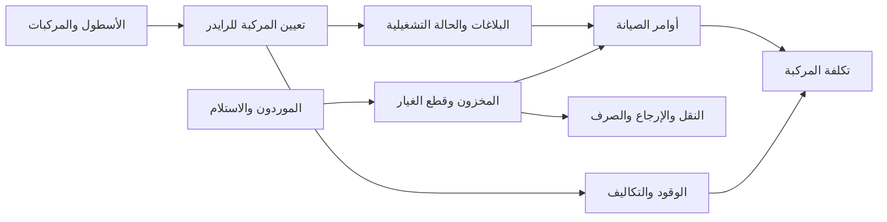

# الخطة الجانبية: المركبات والصيانة والمخزون — الإصدار الثاني

## 1. الهدف وحدود هذه الخطة

هذه خطة مستقلة مبنية على فهم السلوك الموجود في الإصدار القديم، وليست نسخًا لبنيته. لن تدخل نماذج المركبات في الـ migration الأساسي الجاري قبل مراجعة الأسئلة في آخر الخطة واعتماد الخصائص وقواعد العمل.

الإصدار الجديد يجب أن يحقق الآتي:

- سجل ثنائي الاتجاه ودقيق: تاريخ الرايدرز لكل مركبة، وتاريخ المركبات لكل رايدر.
- عدم تخزين `VehicleNumber` داخل ملف الرايدر بوصفه مصدر الحقيقة.
- عدم استعمال رقم اللوحة أو رقم الأصل كمفتاح قاعدة بيانات؛ المفتاح الداخلي دائمًا `Guid` من نوع UUIDv7.
- عدم حذف أي مركبة، تعيين، حركة مخزون، استخدام قطعة، مصروف، أو طلب. الإلغاء والتصحيح يتمان بحالات وأحداث عكسية.
- فصل حالة المركبة التشغيلية عن التعيين، وعن البلاغ، وعن أمر الصيانة.
- دفتر مخزون append-only يكون مصدر الحقيقة، مع رصيد سريع للقراءة محمي بـ `RowVersion`.
- تنفيذ جميع العمليات المركبة داخل transaction واحدة مع حماية من التزامن.
- دعم `GET all` ببيانات قائمة مختصرة للواجهة والبحث الحي محليًا، مع endpoints مستقلة للتفاصيل والسجل الثقيل.

## 2. حدود المجالات

## 3. القواعد المشتركة لكل نموذج قابل للتعديل

كل كيان رئيسي قابل للتعديل يرث من `AuditableEntity` ويحتوي تلقائيًا:

- `Id`: UUIDv7.
- `CreatedAtUtc`, `CreatedByUserId`.
- `UpdatedAtUtc`, `UpdatedByUserId`.
- `RowVersion`: optimistic concurrency في SQL Server.
- `IsDeleted`, `DeletedAtUtc`, `DeletedByUserId`, `DeletionReason`.

كيانات التاريخ ودفتر المخزون لا تقبل الحذف المنطقي المعتاد؛ هي append-only وتحتوي `CreatedAtUtc` و`CreatedByUserId`. التصحيح يسجل حدثًا جديدًا يشير إلى السجل المصحح.

## 4. نماذج الأسطول وخصائصها

### 4.1 `Vehicle`

السجل الرئيسي الثابت نسبيًا للمركبة.

- الهوية: `Id`, `AssetNumber`, `NormalizedAssetNumber`.
- اللوحة: `PlateNumberAr`, `NormalizedPlateNumberAr`, `PlateNumberEn`, `NormalizedPlateNumberEn`, `PlateLetterAr1..3`, `PlateLetterEn1..3`, `PlateDigits`.
- تعريف المصنع: `Vin`, `ChassisNumber`, `EngineNumber`, `ManufacturerId`, `VehicleModelId`, `ModelYear`, `ColorAr`, `ColorEn`.
- التصنيف: `VehicleType`, `FuelType`, `TransmissionType`.
- الملكية: `OwnershipType`, `OwnerName`, `AcquisitionDate`, `AcquisitionCost`, `LeaseContractReference`.
- التسجيل والتأمين: `RegistrationNumber`, `RegistrationExpiryDate`, `InsurancePolicyNumber`, `InsuranceExpiryDate`, `PeriodicInspectionExpiryDate`.
- التشغيل الحالي كنسخة قراءة: `CurrentOperationalStatus`, `CurrentLocationId`, `CurrentOdometer`, `LastOdometerAtUtc`.
- النهاية: `DecommissionedAtUtc`, `DecommissionReason`.
- العرض: `PrimaryImageDocumentId`, `Notes`.

قواعد قاعدة البيانات:

- `AssetNumber` فريد ولا يعاد استعماله حتى بعد الأرشفة.
- `Vin` فريد عندما تكون له قيمة.
- اللوحة العربية المطبّعة فريدة عندما تكون لها قيمة.
- `CurrentOdometer >= 0`, و`ModelYear` ضمن نطاق منطقي.
- حقول `Current...` projections فقط؛ السجل الزمني هو مصدر الحقيقة.

### 4.2 `VehicleManufacturer`

- `Code`, `NameAr`, `NameEn`, `Status`, `DisplayOrder`.
- `Code` فريد.

### 4.3 `VehicleModel`

- `VehicleManufacturerId`, `Code`, `NameAr`, `NameEn`, `VehicleType`, `DefaultFuelType`, `Status`.
- `(VehicleManufacturerId, Code)` فريد.

### 4.4 `FleetLocation`

يمثل مكانًا حقيقيًا يمكن أن توجد فيه مركبة أو مخزون.

- `Code`, `NameAr`, `NameEn`, `LocationType` (`CompanyWarehouse`, `Housing`, `Workshop`, `ExternalWorkshop`).
- `HousingId` اختياري، `Address`, `Latitude`, `Longitude`, `Status`.
- عند `LocationType = Housing` يجب وجود `HousingId`، وفي الأنواع الأخرى يجب ألا يوجد.

### 4.5 `VehicleOdometerReading`

- `VehicleId`, `Reading`, `RecordedAtUtc`, `SourceType`, `SourceEntityId`, `EvidenceDocumentId`, `Notes`.
- لا يسمح بقراءة سالبة أو قراءة أقل من السابقة إلا بعملية تصحيح مع سبب وموافقة.
- فهرس `(VehicleId, RecordedAtUtc DESC)`.

### 4.6 `VehicleOperationalStatusPeriod`

- `VehicleId`, `Status`, `EffectiveFromUtc`, `EffectiveToUtc`.
- `ReasonCode`, `Reason`, `SourceType`, `SourceEntityId`, `ChangedByUserId`.
- الحالات المقترحة: `Available`, `Assigned`, `ProblemHold`, `MaintenanceHold`, `Stolen`, `OutOfService`, `Decommissioned`.
- فهرس filtered unique على `VehicleId` عندما `EffectiveToUtc IS NULL` لضمان حالة حالية واحدة.
- `Returned`, `Fixed`, و`Switched` أحداث وليست حالات طويلة العمر.

## 5. التعيين والتاريخ الثنائي بين المركبة والرايدر

### 5.1 `RiderVehicleAssignment`

هذا هو مصدر الحقيقة لعلاقة الرايدر بالمركبة.

- الأطراف: `RiderProfileId`, `EmployeeId`, `VehicleId`.
- الربط التشغيلي: `OperationId` لربط الاستلام/الإرجاع/التبديل في عملية واحدة، و`PreviousAssignmentId` عند التبديل.
- البداية: `StartedAtUtc`, `StartLocationId`, `StartOdometer`, `StartVehicleCondition`, `StartFuelLevelPercentage`.
- النهاية: `EndedAtUtc`, `EndLocationId`, `EndOdometer`, `EndVehicleCondition`, `EndFuelLevelPercentage`.
- التصريح: `PermissionReference`, `PermissionStartsOn`, `PermissionEndsOn`.
- القرار: `Status` (`Planned`, `Active`, `Completed`, `Cancelled`, `Corrected`).
- الأسباب: `AssignmentReason`, `CompletionReason`, `CancellationReason`.
- المسؤولون: `HandedOverByUserId`, `ReceivedBackByUserId`, `AssignedByUserId`, `EndedByUserId`.
- الإثبات: `StartChecklistJson`, `EndChecklistJson`, `StartEvidenceDocumentGroupId`, `EndEvidenceDocumentGroupId`.
- الاستثناءات: `WasBackdated`, `BackdatedReason`, `CorrectionOfAssignmentId`, `CorrectionReason`.
- ملاحظات: `Notes`.

القيود الحاسمة:

- filtered unique على `RiderProfileId` عندما `EndedAtUtc IS NULL AND IsDeleted = 0`.
- filtered unique على `VehicleId` عندما `EndedAtUtc IS NULL AND IsDeleted = 0`.
- `EndedAtUtc > StartedAtUtc` عند وجود النهاية.
- `EndOdometer >= StartOdometer` ما لم يوجد تصحيح معتمد.
- `EmployeeId` يجب أن يطابق الموظف المرتبط بـ `RiderProfileId`.
- تفعيل التعيين يفتح حالة `Assigned` للمركبة في transaction نفسها.
- إنهاء التعيين يغلق الحالة الحالية وينشئ `Available` أو حالة حجب مناسبة.

### 5.2 `RiderVehicleAssignmentEvent`

سجل append-only لكل ما حدث داخل التعيين:

- `RiderVehicleAssignmentId`, `OperationId`, `EventType`.
- `OccurredAtUtc`, `ActorUserId`, `Reason`.
- `BeforeJson`, `AfterJson`, `CorrelationId`.
- الأنواع: `Requested`, `Approved`, `Started`, `PermissionRenewed`, `Returned`, `SwitchedOut`, `SwitchedIn`, `Corrected`, `Cancelled`.

### 5.3 `VehicleOperationRequest`

- `RequestNumber`, `RequestType` (`Take`, `Return`, `Switch`, `ReportProblem`, `Recover`, `Relocate`).
- `RequestedByUserId`, `RequestedForRiderProfileId`.
- `CurrentVehicleId`, `RequestedVehicleId`, `RequestedLocationId`.
- `Reason`, `RequestedAtUtc`, `RequestedEffectiveAtUtc`.
- `Status` (`Pending`, `Approved`, `Rejected`, `Cancelled`, `Executed`, `Failed`).
- `ReviewedByUserId`, `ReviewedAtUtc`, `ReviewReason`.
- `ExecutedAtUtc`, `ResultingAssignmentId`, `FailureCode`, `FailureDetails`.
- `RowVersion` يمنع اعتماد الطلب مرتين.

### 5.4 الاستعلامان الإلزاميان للتاريخ

`GET /api/v1/vehicles/{vehicleId}/rider-timeline`

- يعيد جميع التعيينات مرتبة تنازليًا.
- كل عنصر يعيد بيانات الرايدر المختصرة، البداية والنهاية والمدة، مواقع التسليم والاسترجاع، العداد، التصريح، الأسباب، المسؤولين، الحالة، والمشكلات والصيانة والوقود الواقعة داخل الفترة.

`GET /api/v1/riders/{riderProfileId}/vehicle-timeline`

- يعيد نفس DTO ونفس الحقائق، لكن مجمعة من جهة الرايدر.
- يجب أن يعطي الطرفان نفس `AssignmentId` ونفس القيم؛ يوجد integration test يثبت التناظر.

## 6. البلاغات والصيانة

### 6.1 `VehicleIssue`

- `IssueNumber`, `VehicleId`, `ReportedByUserId`, `ReportedAtUtc`.
- `Category`, `Severity`, `Description`, `LocationId`, `OdometerAtReport`.
- `Status` (`Open`, `Triaged`, `WorkOrderCreated`, `Resolved`, `Closed`, `Rejected`).
- `SafetyCritical`, `VehicleBlocked`, `ResolvedAtUtc`, `ResolvedByUserId`, `ResolutionSummary`.
- `RelatedAssignmentId` يحفظ الرايدر المستخدم وقت البلاغ صراحة.

### 6.2 `VehicleIssueEvent`

- `VehicleIssueId`, `EventType`, `FromStatus`, `ToStatus`, `OccurredAtUtc`, `ActorUserId`, `Reason`, `SnapshotJson`.
- append-only.

### 6.3 `MaintenanceWorkOrder`

- `WorkOrderNumber`, `VehicleId`, `VehicleIssueId` اختياري.
- `MaintenanceType` (`Preventive`, `Corrective`, `Inspection`, `AccidentRepair`).
- `Priority`, `Status`, `WorkshopLocationId`, `ExternalSupplierId` اختياري.
- `OpenedAtUtc`, `ScheduledAtUtc`, `StartedAtUtc`, `CompletedAtUtc`, `ClosedAtUtc`.
- `OdometerAtOpen`, `OdometerAtCompletion`.
- `Diagnosis`, `WorkPerformed`, `QualityCheckNotes`.
- `OpenedByUserId`, `AssignedTechnicianUserId`, `ApprovedByUserId`, `ClosedByUserId`.
- `EstimatedCost`, `ActualPartsCost`, `ActualLaborCost`, `ActualExternalCost`, `ActualTotalCost`.
- `RowVersion`.

### 6.4 `MaintenanceWorkOrderPart`

- `MaintenanceWorkOrderId`, `InventoryItemId`, `InventoryLocationId`.
- `Quantity`, `UnitCost`, `TotalCost`, `StockMovementLineId`.
- `InstalledAtUtc`, `InstalledByUserId`, `Notes`.
- لا يحذف؛ التصحيح يولد حركة عكسية وسطرًا جديدًا.

### 6.5 `MaintenanceLaborEntry`

- `MaintenanceWorkOrderId`, `TechnicianUserId` أو `ExternalTechnicianName`.
- `StartedAtUtc`, `EndedAtUtc`, `Hours`, `HourlyRate`, `TotalCost`, `Description`.

### 6.6 `MaintenancePlan`

- `Code`, `NameAr`, `NameEn`, `VehicleModelId` أو `VehicleType`.
- `TriggerType` (`Days`, `Odometer`, `WhicheverComesFirst`).
- `IntervalDays`, `IntervalKilometers`, `AlertDaysBefore`, `AlertKilometersBefore`.
- `InventoryItemId` اختياري، `ChecklistJson`, `Status`.
- قاعدة تمنع إعداد trigger بلا interval مناسب.

### 6.7 `VehicleMaintenanceSchedule`

نسخة محسوبة وسريعة للقراءة لكل مركبة وخطة:

- `VehicleId`, `MaintenancePlanId`, `LastCompletedWorkOrderId`.
- `LastCompletedAtUtc`, `LastCompletedOdometer`.
- `NextDueOn`, `NextDueOdometer`, `ComputedStatus`, `ComputedAtUtc`.
- unique على `(VehicleId, MaintenancePlanId)`.

## 7. قطع الغيار والإكسسوارات والمخزون

### 7.1 `InventoryItem`

- `Sku`, `Barcode`, `ItemType` (`SparePart`, `RiderAccessory`, `Consumable`).
- `NameAr`, `NameEn`, `DescriptionAr`, `DescriptionEn`.
- `UnitOfMeasure`, `DefaultUnitCost`, `MinimumStockLevel`, `ReorderQuantity`.
- `IsSerialized`, `IsLotTracked`, `Status`.
- `Sku` فريد ولا يعاد استعماله.

### 7.2 `InventoryLocation`

- `Code`, `NameAr`, `NameEn`, `LocationType`, `FleetLocationId`, `HousingId`, `Status`.
- exactly one owner rule عند ارتباطه بسكن أو موقع أسطول.

### 7.3 `StockBalance`

- `InventoryItemId`, `InventoryLocationId`, `QuantityOnHand`, `QuantityReserved`, `AverageUnitCost`, `LastMovementAtUtc`, `RowVersion`.
- unique على `(InventoryItemId, InventoryLocationId)`.
- لا يسمح برصيد سالب إلا بسياسة override مع صلاحية وسبب وتدقيق.

### 7.4 `StockMovement` و`StockMovementLine`

رأس الحركة:

- `MovementNumber`, `MovementType`, `OccurredAtUtc`, `SourceLocationId`, `DestinationLocationId`.
- `SourceDocumentType`, `SourceDocumentId`, `Reason`, `PostedByUserId`, `ReversalOfMovementId`, `Status`.

السطر:

- `StockMovementId`, `InventoryItemId`, `Quantity`, `UnitCost`, `TotalCost`, `LotNumber`, `SerialNumber`.
- الحركات posted لا تعدل. الإلغاء ينشئ reversal مرتبطًا بالأصل.

### 7.5 `Supplier`

- `SupplierNumber`, `LegalNameAr`, `LegalNameEn`, `VatNumber`, `CommercialRegistrationNumber`.
- `ContactName`, `Phone`, `Email`, `Address`, `PaymentTermsDays`, `Status`, `Notes`.

### 7.6 `PurchaseReceipt` و`PurchaseReceiptLine`

- الرأس: `ReceiptNumber`, `SupplierId`, `SupplierInvoiceNumber`, `InvoiceDate`, `ReceivedAtUtc`, `InventoryLocationId`, `Subtotal`, `TaxAmount`, `TotalAmount`, `Status`, `PostedMovementId`.
- السطر: `InventoryItemId`, `Quantity`, `UnitCost`, `TaxAmount`, `TotalCost`, `LotNumber`, `ExpiryDate`.
- `(SupplierId, SupplierInvoiceNumber)` فريد عند وجود رقم فاتورة.

### 7.7 `StockTransfer` و`StockTransferLine`

- الرأس: `TransferNumber`, `SourceLocationId`, `DestinationLocationId`, `RequestedAtUtc`, `ShippedAtUtc`, `ReceivedAtUtc`, `Status`, `RequestedByUserId`, `ApprovedByUserId`, `ReceivedByUserId`, `Reason`.
- السطر: `InventoryItemId`, `RequestedQuantity`, `ShippedQuantity`, `ReceivedQuantity`, `UnitCost`.
- المصدر والوجهة لا يمكن أن يكونا متساويين.

### 7.8 `SupplierReturn` و`SupplierReturnLine`

- الرأس: `ReturnNumber`, `SupplierId`, `InventoryLocationId`, `PurchaseReceiptId`, `Status`, `Reason`, `ReturnedAtUtc`, `PostedMovementId`.
- السطر: `InventoryItemId`, `Quantity`, `UnitCost`, `Reason`, `PurchaseReceiptLineId`.

### 7.9 `RiderInventoryIssue` و`RiderInventoryIssueLine`

- الرأس: `IssueNumber`, `RiderProfileId`, `IssuedFromLocationId`, `IssuedAtUtc`, `IssuedByUserId`, `RelatedAssignmentId`, `Status`, `Notes`.
- السطر: `InventoryItemId`, `Quantity`, `UnitCost`, `StockMovementLineId`, `ExpectedReturn`, `ReturnedQuantity`.
- يحل محل نموذج إكسسوارات منفصل عندما يكون الفرق مجرد `ItemType`.

## 8. الوقود والتكلفة

### 8.1 `FuelImportBatch`

- `SourceFileName`, `FileChecksum`, `ImportedAtUtc`, `ImportedByUserId`.
- `OperationalReportDate`, `ImportSchemaVersion`, `TotalRows`, `MatchedRows`, `UnmatchedRows`, `RejectedRows`, `Status`, `ErrorSummary`.
- checksum فريد لمنع استيراد الملف نفسه مرتين.

### 8.2 `FuelTransaction`

- `FuelImportBatchId`, `SourceRowNumber`, `ExternalTransactionId`, `VehicleId` اختياري.
- `OccurredAtUtc`, `PlateTextFromSource`, `NormalizedPlateFromSource`.
- `Liters`, `UnitPrice`, `TotalAmount`, `Odometer` اختياري، `StationName`.
- `MatchStatus`, `MatchMethod`, `ResolutionErrorCode`, `ResolutionErrorDetails`, `MatchedByUserId`, `MatchedAtUtc`, `Notes`.
- الصف غير المطابق لا يضيع ويظهر في شاشة المعالجة اليدوية.

### 8.3 `FuelCostAllocation`

- `FuelTransactionId`, `RiderVehicleAssignmentId` اختياري، `RiderProfileId` اختياري.
- `AllocatedAmount`, `AllocationPercentage`, `AttributedSeconds`, `AllocationMethod`, `AlgorithmVersion`, `Confidence`, `AllocatedAtUtc`, `AllocatedByUserId`.
- التوزيع يعتمد على التعيين الفعال عند وقت العملية، لا على قيمة حالية داخل الرايدر.
- مجموع `AllocatedAmount` للتوزيعات الفعالة يجب أن يساوي `FuelTransaction.TotalAmount`، أو يبقى الفرق في توزيع `Unattributed` واضح.

### 8.4 `FuelAllocationEvent`

- `FuelTransactionId`, `EventType` (`Attributed`, `Recalculated`, `ManualOverride`, `Reversed`, `Corrected`).
- `OccurredAtUtc`, `ActorUserId`, `Reason`, `BeforeJson`, `AfterJson`, `CorrelationId`.
- append-only؛ لا تعدل التوزيعات السابقة بصمت.

### 8.5 `VehicleExpense`

- `VehicleId`, `ExpenseType`, `SourceEntityType`, `SourceEntityId`.
- `OccurredOn`, `AmountBeforeTax`, `TaxAmount`, `TotalAmount`, `CurrencyCode`, `Description`.
- projection موحد للتقارير؛ المصدر المالي الأصلي يبقى أمر الصيانة أو الوقود أو مستند الشراء.

## 9. عمليات الاستلام والإرجاع والتبديل

### الاستلام

1. قفل منطقي/transaction على الرايدر والمركبة.
2. التأكد من تفعيل الرايدر وعدم وجود تعيين نشط له.
3. التأكد من حالة المركبة `Available` وعدم وجود تعيين نشط عليها.
4. تسجيل قراءة العداد وفحص التسليم.
5. إنشاء `RiderVehicleAssignment` نشط.
6. إغلاق حالة `Available` وفتح `Assigned`.
7. تسجيل event وتحديث projections.

### الإرجاع

1. تحميل التعيين النشط نفسه بـ `RowVersion`.
2. تسجيل موقع/عداد/حالة الإرجاع.
3. إنهاء التعيين.
4. فتح `Available` إذا لا يوجد بلاغ حجب، وإلا `ProblemHold` أو `MaintenanceHold`.
5. تسجيل event؛ لا ينشأ تعيين “Returned” زائف.

### التبديل

1. transaction واحدة و`OperationId` واحد.
2. التحقق من المركبة الجديدة أولًا مع قفل التزامن.
3. إنهاء القديم بـ `SwitchedOut`.
4. إنشاء الجديد بـ `PreviousAssignmentId` و`SwitchedIn`.
5. إذا فشل أي جزء تتراجع العملية كلها.

## 10. واجهات API المقترحة

جميع المسارات تحت `/api/v1`، وكل controller رفيع ويستدعي service يعيد `Result<T>`.

- `GET /vehicles`: جميع المركبات كـ compact list DTO للبحث الحي في Next.js.
- `GET /vehicles/{id}` و`GET /vehicles/{id}/timeline`.
- `POST /vehicles`, `PUT /vehicles/{id}`, `POST /vehicles/{id}/archive`, `POST /vehicles/{id}/restore`.
- `POST /vehicle-assignments/take`, `/return`, `/switch`, `/correct`.
- `GET /vehicles/{id}/rider-timeline`, `GET /riders/{id}/vehicle-timeline`.
- `GET/POST /vehicle-operation-requests`, `POST /{id}/approve`, `/reject`, `/cancel`.
- `GET/POST /vehicle-issues`, `POST /{id}/triage`, `/resolve`, `/close`.
- `GET/POST /maintenance/work-orders`, `POST /{id}/start`, `/complete`, `/close`, `/cancel`.
- `GET/POST/PUT /maintenance/plans`, `POST /{id}/archive`, `GET /maintenance/due`.
- `GET /inventory/items`, `/inventory/balances`, `/inventory/movements`.
- `POST /inventory/receipts`, `/transfers`, `/supplier-returns`, `/rider-issues`, `/corrections`.
- `POST /fuel/imports`, `GET /fuel/unmatched`, `POST /fuel/{id}/resolve`.

لا توجد HTTP DELETE endpoints تشغيلية. الأرشفة والإلغاء والتصحيح أوضح وتحافظ على التاريخ.

## 11. أداء `GET all` والبحث الحي في الواجهة

- endpoint القائمة يعيد فقط الخصائص اللازمة للجدول والبحث، وليس الصور أو الـ JSON أو التاريخ.
- الاستعلام `AsNoTracking`, projection مباشر، وترتيب ثابت.
- ضغط Brotli/Gzip وETag مبني على `DatasetVersion`.
- Next.js يحمل القائمة مرة، يخزنها في query cache، وينفذ live search بعد debounce قصير.
- تطبيع البحث العربي والإنجليزي مسبقًا في أعمدة normalized وفهارس مناسبة.
- كل تعديل يعيد `datasetVersion` جديدًا كي تعيد الواجهة الجلب عند الحاجة.
- التفاصيل، التاريخ، الصيانة، والحركات المالية endpoints مستقلة ولا تدخل في `GET all`.
- قبل الإنتاج ننفذ benchmark بأحجام 1k و10k و50k مركبة. إذا تجاوز payload أو الذاكرة الحد المقبول نحافظ على تجربة البحث نفسها باستخدام indexed server search؛ لا نحمّل سجل الصيانة الكامل للمتصفح.

## 12. الأمن والتدقيق

صلاحيات منفصلة على الأقل:

- `Fleet.Vehicles.View/Create/Update/Archive`.
- `Fleet.Assignments.View/Take/Return/Switch/Correct`.
- `Fleet.Requests.Submit/Review`.
- `Fleet.Issues.View/Report/Resolve`.
- `Maintenance.WorkOrders.View/Create/Approve/Complete`.
- `Inventory.Items.View/Manage`, `Inventory.Stock.View/Move/Adjust`.
- `Purchasing.Receipts.Manage`, `Purchasing.Returns.Manage`.
- `Fuel.View/Import/Resolve`, `Fleet.Costs.View/Export`.

ضوابط إضافية:

- نطاق الوصول يمكن أن يقيد المستخدم بسكن/موقع مخزون محدد.
- تعديل العداد للخلف، تعديل تعيين تاريخي، المخزون السالب، أو تصدير تكاليف حساسة يتطلب صلاحية أعلى وسببًا إلزاميًا.
- كل command يسجل actor/session/correlation/reason وbefore/after عند القيم الحساسة.
- الملفات تفحص النوع والحجم والتوقيع، وتخزن خارج web root.
- استيرادات الوقود idempotent، ولا تثق باسم الملف أو بيانات اللوحة دون تطبيع ومطابقة.

## 13. الفهارس والتزامن

- filtered unique للتعيين النشط لكل رايدر ولكل مركبة.
- filtered unique للحالة التشغيلية الحالية لكل مركبة.
- `(VehicleId, StartedAtUtc DESC)` و`(RiderProfileId, StartedAtUtc DESC)` للتاريخ الثنائي.
- `(VehicleId, OccurredAtUtc DESC)` للعداد والوقود والمصروفات.
- `(Status, CurrentLocationId)` لقائمة الأسطول.
- `(InventoryItemId, InventoryLocationId)` فريد للرصيد.
- `(InventoryLocationId, OccurredAtUtc DESC)` للحركات.
- `RowVersion` على Vehicle، Assignment، Request، WorkOrder، StockBalance، Transfer، Receipt.
- execution strategy + transaction + idempotency key لعمليات take/return/switch/post stock/import.

## 14. الاختبارات المطلوبة

- unit tests لكل انتقال حالة مسموح ومرفوض.
- اختبار تنافس طلبَي استلام للمركبة نفسها؛ ينجح واحد فقط.
- اختبار تنافس مركبتين للرايدر نفسه؛ ينجح واحد فقط.
- اختبار switch atomic rollback.
- اختبار التناظر بين vehicle timeline وrider timeline باستخدام نفس `AssignmentId`.
- اختبار إسناد الوقود على حدود أوقات بداية/نهاية التعيين.
- اختبار حركة المخزون وعكسها وأن مجموع الدفتر يساوي الرصيد.
- اختبار عدم إمكان hard delete أو تعديل ledger posted.
- integration tests لـ ProblemDetails، 401/403، RowVersion conflict، idempotency.
- benchmark لـ GET all والبحث وtimeline الكبير.

## 15. مراحل التنفيذ الجانبية

1. اعتماد الأسئلة والخصائص والحالات فقط؛ لا كود قاعدة بيانات.
2. إضافة نماذج الأسطول والمواقع والعداد مع configurations واختبارات invariants.
3. إضافة التعيين والسجل الثنائي وطلبات الموافقة.
4. إضافة البلاغات وأوامر الصيانة والخطط الدورية.
5. إضافة دفتر المخزون والموردين والاستلام والنقل والإرجاع والصرف.
6. إضافة الوقود والتكاليف والمطابقة اليدوية.
7. إضافة services/controllers وفق النمط الحالي ثم Next.js screens.
8. اختبار الأداء والأمن والترحيل من البيانات القديمة في بيئة staging.

## 16. أسئلة يجب اعتمادها قبل بناء API المركبات

### المركبة واللوحة

1. ما أنواع المركبات الفعلية: دراجة نارية، سيارة، فان، شاحنة؟
2. هل `AssetNumber` يولد تلقائيًا أم يُدخل يدويًا؟ وما شكله؟
3. هل اللوحات كلها سعودية؟ وهل يلزم حفظ الأحرف العربية والإنجليزية منفصلة؟
4. هل VIN/رقم الهيكل إلزامي لكل الأنواع؟
5. هل المركبات مملوكة فقط أم توجد عقود إيجار وتأجير من طرف ثالث؟

### التعيين

6. هل الرايدر يستطيع حمل أكثر من مركبة في حالات استثنائية؟ الخطة تفترض لا.
7. هل التعيين يبدأ وينتهي بالتاريخ والوقت أم بالتاريخ فقط؟ الخطة توصي UTC date-time.
8. ما بيانات التصريح بالضبط؟ وهل التجديد تلقائي أم يحتاج موافقة؟
9. ما checklist وصور الاستلام والإرجاع الإلزامية؟
10. من يملك صلاحية take/return/switch المباشر، ومن يرسل طلبًا فقط؟

### الحالة والصيانة

11. هل البلاغ يجبر إنهاء التعيين دائمًا، أم يمكن للرايدر الاحتفاظ بالمركبة وهي محجوبة مؤقتًا؟
12. هل الصيانة داخل ورشة البوابة، خارجية، أم كلاهما؟
13. هل الاستحقاق بالأيام، العداد، أم الاثنين؟
14. هل توجد قراءة عداد موثوقة في الوقود أو جهاز تتبع؟

### المخزون

15. هل لكل سكن مخزن فعلي مستقل؟ ومن يعتمد النقل والاستلام؟
16. هل توجد قطع serial/lot/expiry أو كلها quantity فقط؟
17. هل يسمح بالمخزون السالب مطلقًا؟ الخطة تفترض الرفض افتراضيًا.
18. هل الإكسسوارات عهدة يجب إرجاعها أم مواد مستهلكة؟ قد يختلف حسب الصنف.
19. هل الفاتورة تشمل ضريبة القيمة المضافة والخصومات والمصاريف الإضافية؟

### الوقود والتقارير

20. ما مزود ملف الوقود وشكل الملف ومعرف العملية الفريد؟
21. إذا وقع الوقود خارج فترة تعيين، هل يبقى غير منسوب أم يراجع يدويًا؟
22. هل تظهر التكلفة لكل المستخدمين أم لأدوار مالية فقط؟
23. ما مدة الاحتفاظ بالملفات الأصلية وتقارير التصدير؟
24. عندما يستخدم رايدان المركبة في اليوم نفسه، هل تقسم التكلفة حسب ثواني/ساعات الاستخدام، بالتساوي، أم تُرسل للمراجعة اليدوية؟ الخطة توصي بالمدة الفعلية مع إظهار نسبة الثقة.
